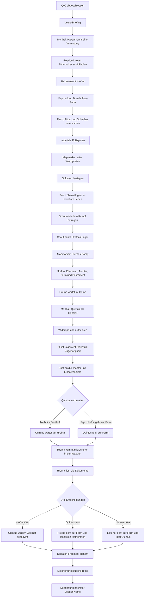

# Q01 Enhanced – Story Arc und Visualisierung

## Dramaturgische Bewegung

Q01 beginnt mit einer Vermutung, die Hakan erst nach einer überprüfbaren kleinen Aufgabe ausspricht. Die Quest führt dadurch von einer unklaren Leiche zu einer benannten Verdächtigen, von der Farm zu imperialen Fußspuren, vom Wachposten zu Hrefnas Lager und schließlich zurück nach Morthal. Der eigentliche Prüfungsort entsteht erst, nachdem der Listener Quintus enttarnt und seine privaten sowie dienstlichen Dokumente gefunden hat.

| Phase | Pflichtfrage | Spieleraktion | Ergebnis |
|---|---|---|---|
| 1. Auftrag | Was ist geschehen? | Hakan befragen | Hakan kennt Fakten, aber noch keinen Täter |
| 2. Beweis gegen Vertrauen | Wen verdächtigt Hakan? | Roten Fährmarker zurückholen | Hakan nennt Hrefna; Farmmarker erscheint |
| 3. Farm | Warum verschwand Hrefna? | Ritual, Schulden und imperiale Fußspuren untersuchen | Wachpostenmarker erscheint |
| 4. Wachposten | Wer beobachtet den Fall? | Soldaten besiegen, Scout überwältigen, am Leben lassen und befragen | Scout nennt Hrefnas Lager; Campmarker erscheint |
| 5. Hrefnas Geschichte | Was hat sie verloren? | Im Lager sprechen und ihre Verluste erfahren | Ehemann, Tochter, Farm und Sakrament werden verbunden |
| 6. Quintus | Wer ist der Händler wirklich? | Widersprüche sammeln und Wahrheit erzwingen | Penitus-Oculatus-Identität wird bestätigt |
| 7. Dokumente | Was weiß der Oculatus? | Brief an die Tochter und Einsatzunterlagen finden | Private Menschlichkeit und größeres Muster werden sichtbar |
| 8. Vorbereitung | Wo soll Quintus sein? | Bleiben lassen oder mit einer Lüge zur Farm schicken | Quintus befindet sich in Gasthof oder Farmnähe |
| 9. Konfrontation | Wer trägt den zweiten Mord? | Hrefna liest die Dokumente; drei Ausgänge wählen | Hrefna tötet, Hrefna lässt sich festnehmen oder Listener tötet |
| 10. Urteil | Was bedeutet die Entscheidung? | Fragment sichern und über Hrefna urteilen | Proven, Unproven, Release oder Silence |
| 11. Übergang | Was folgt aus der Stille? | Debrief und Ledger | Q02–Q05 werden als zusammenhängende Ernte vorbereitet |

## Mermaid-Visualisierung

## Warum der Arc länger wirkt

Die zusätzliche Länge entsteht aus kausalen Übergängen. Hakan nennt den Täter erst nach einer überprüfbaren Gegenleistung. Der Farmmarker entsteht aus seiner Aussage, der Wachpostenmarker aus den imperialen Fußspuren, und der Campmarker aus dem überlebenden Scout. Hrefna wird erst nach dieser Kette gefunden. Danach folgen Enttarnung, Dokumentenfund und eine Vorbereitung, bevor der eigentliche Mord oder die Festnahme stattfindet.
