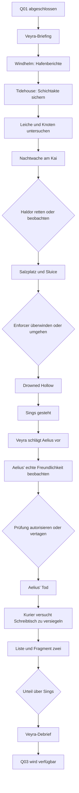

# Q02 Enhanced – Story Arc und Visualisierung

## Dramaturgische Bewegung

Q02 beginnt als Hafenserie ungeklärter Todesfälle. Die Enhanced-Fassung baut vor der Nachtwache eine überprüfbare Aktenrecherche ein, führt danach über einen zweiten Außenencounter in die Drowned Hollow und lässt Sings’ Prüfung erst nach einer Beobachtung von Aelius beginnen. Jede Erweiterung beantwortet eine konkrete Frage: Wer führt die Schichten? Wer schützt die Spuren? Wie findet der Listener den Zugang? Ist Aelius’ Freundlichkeit nur eine Maske? Wer versucht, die Papiere nach seinem Tod zu versiegeln?

| Phase | Leitfrage | Spieleraktion | Ergebnis |
|---|---|---|---|
| 1. Auftrag | Was verbindet die Toten? | Torbjorn und Drinks befragen | Knoten, Beschwerden und Arbeiterstille |
| 2. Tidehouse | Wer kontrollierte die Schichten? | Versiegelte Akte öffnen und Wächter überwinden | Ledger mit Aelius’ Korrekturen |
| 3. Leiche | Was geschah im Wasser? | Körper, Tauwerk und Schleifspuren prüfen | Mordmethode ohne Täterbeweis |
| 4. Nachtwache | Wer handelt im Schutz der Dunkelheit? | Haldors Angriff beobachten oder unterbrechen | Sings’ Spur bleibt offen |
| 5. Salzplatz | Wer sucht nach der Wahrheit? | Enforcer bekämpfen oder am Sluice umgehen | Zugang zur Drowned Hollow |
| 6. Hollow | Wer ist der Täter? | Sings stellen, Geständnis anhören | Motivation und Veezara-Bezug |
| 7. Aelius | Ist Freundlichkeit echt? | Aelius vor dem Auftrag beobachten | Menschlichkeit und Überwachung bestehen zugleich |
| 8. Prüfung | Kann Sings ohne Hass töten? | Auftrag autorisieren, vertagen oder übernehmen | Täterstatus wird feststellbar |
| 9. Kurier | Wer löscht die Akte? | Imperialen Kurier vom Schreibtisch vertreiben | Oculatus-Spur wird konkret |
| 10. Liste | Was wurde gesammelt? | Namensliste sichern oder zurücklassen | Fragment zwei, aber kein Endgegner |
| 11. Urteil | Was bedeutet die Tat? | Über Sings entscheiden | Aufnahme, offene Aufnahme, Freilassung, Schweigen oder Übergabe |
| 12. Debrief | Was folgt aus zwei Fragmenten? | Bericht und Vergleich mit Q01 | Muster wächst, Schuld bleibt offen |

## Visualisierung

Die beiden Begegnungen am Tidehouse und am Salzplatz bleiben klein. Sie erweitern die Ursachen- und Ortslogik, ohne einen neuen Hauptantagonisten neben Sings und Aelius zu setzen.

