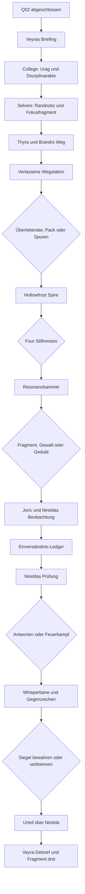

# Q03 Enhanced – Story Arc und Visualisierung

Q03 bleibt die Rekrutierungsprüfung für Nirelda Aurantil. Die Erweiterungen beantworten konkrete offene Fragen: Wer widerspricht der College-Akte? Was geschah auf der Straße? Wie gelangt der Listener in den Turm? Welche Grenze hat Nirelda selbst bisher erkannt? Und wie kann die Whisperbane-Spur wachsen, ohne L.M. vorzeitig zu enthüllen?

| Phase | Leitfrage | Spieleraktion | Ergebnis |
|---|---|---|---|
| 1. Auftrag | Warum verschwinden Reisende? | Veyras Briefing annehmen | College und Nirelda als offene Spur |
| 2. Disziplinarakte | Was weiß das College wirklich? | Urag überzeugen, bestechen oder umgehen | Unfallbericht ohne eindeutiges Urteil |
| 3. Selveni | Wer widerspricht der Akte? | Zeugenaussage und Kopie prüfen | Fokusfragment und menschliche Erinnerung |
| 4. Thyra | Wer trägt den Verlust? | Witwe befragen | Brandrs Verschwinden wird konkret |
| 5. Wegstation | Was geschah auf der Straße? | Überlebenden helfen, Pack prüfen oder Spuren folgen | Nirelda testete Reaktionen, suchte aber nicht nach Beute |
| 6. Hollowfrost Spire | Wie wird der Turm erreicht? | Four Stillnesses lesen, brechen oder entschärfen | Methode des Listeners wird sichtbar |
| 7. Resonanzkammer | Was erinnert sich an Nireldas Unfall? | Fokusfragment, Gewalt oder Geduld wählen | Zugang zur inneren Kammer |
| 8. Joric | Ist ein Sterbender ein Mensch oder ein Messwert? | Heilen, beobachten oder unterbrechen | Erste Grenze zwischen Listener und Nirelda |
| 9. Einverständnis-Ledger | Welche Grenzen hat Nirelda selbst? | Verweigerung, verspätete Einsicht oder Abschluss prüfen | Prüfung erhält eine persönliche Grundlage |
| 10. Nireldas Prüfung | Kann Wissen ohne Besitz dienen? | Zwei von drei Fragen tragfähig beantworten oder kämpfen | Freiwillige Unterordnung oder kontrollierte Niederlage |
| 11. Whisperbane | Wer bestellte das Gift? | Auftrag und Gegenzeichen sichern oder verbrennen | Fragment drei ohne L.M.-Enthüllung |
| 12. Urteil | Wohin gehört Nirelda? | Aufnahme, College, Exil oder Schweigen | Arcanum, offene Frage oder Verlust |
| 13. Debrief | Was verbindet die Fragmente? | Bericht und Spur einordnen | Q04 wird vorbereitet |

Die Erweiterungen bleiben bewusst klein: eine College-Zeugin, ein generischer Straßenüberlebender, eine Wegstation und eine Resonanzkammer. Es gibt keinen neuen Hauptantagonisten und keine zusätzliche Fraktion neben College, Nirelda und der im Hintergrund bleibenden Oculatus-Spur.
