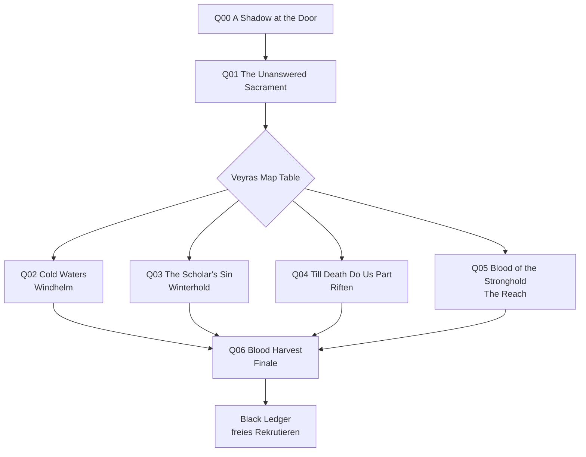
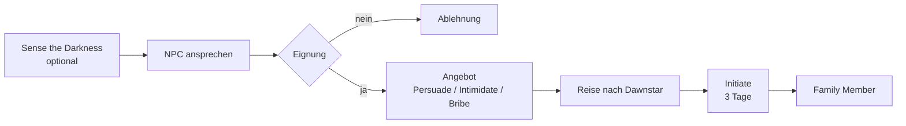
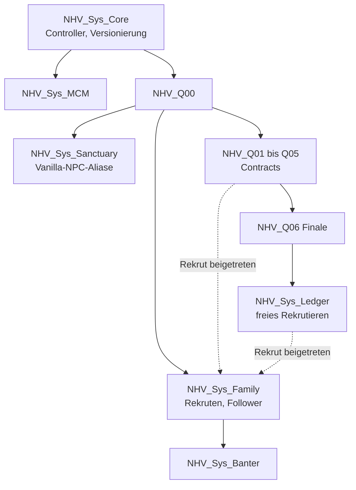

# Night's Harvest – Konzeptdokument

2026-09-21 · @Someone

## 1. Überblick & Vision

**Night's Harvest** (Arbeitstitel) ist eine storygetriebene Dark-Brotherhood-Erweiterung für Skyrim SE/AE: Eine neue Rekrutiererin baut mit dem Listener die Familie in der Dawnstar Sanctuary neu auf – über fünf Rekrutierungs-Contracts, ein Finale und ein anschließendes freies Rekrutierungssystem.

### Pitch

Nach „Hail Sithis!“ ist die Familie fast ausgelöscht: Nazir, Babette, vielleicht Cicero, Shadowmere und ein Sarg. Eines Abends sitzt eine Fremde in der Sanctuary, obwohl die Black Door niemanden hereinlässt, der nicht zur Familie gehört. Nazir hat die Klinge an ihrem Hals.

Sie heißt **Veyra Othren**, eine Dunmer aus der alten cyrodiilischen Bruderschaft. Man nannte sie „the Gleaner“ – die Nachleserin, die nach der Ernte aufsammelt, was die Schnitter übrig ließen. Sie führt ein Register über Menschen in Skyrim, die bereits getötet haben und noch nicht wissen, dass sie Familie sind.

Gemeinsam findet, prüft und rekrutiert der Listener fünf außergewöhnliche Kandidaten. Dabei zieht sich ein roter Faden durch alle Missionen: Ein letzter Penitus-Oculatus-Zirkel jagt die Überlebenden – und plant ein zweites Falkreath.

### Design-Pfeiler

1. **Lore first.** Fühlt sich an wie ein Bethesda-DLC. Folgt der alten DB-Tradition: Die Bruderschaft wirbt nicht, sie findet jene, die bereits getötet haben (Lucien Lachance' Methode aus Oblivion).
2. **Entscheidungen mit Konsequenzen.** Jede Mission hat mindestens drei Ausgänge: rekrutieren, töten, ziehen lassen. Wer lebt, prägt Sanctuary, Finale und Dialoge.
3. **Eine lebendige Sanctuary.** Jeder Rekrut hat eine Rolle, einen Service, einen Tagesablauf und Banter mit den anderen.
4. **Sauber & kompatibel.** Keine Edits an Vanilla-Records. Ein eigener Sanctuary-Flügel statt Umbau. SKSE und SkyUI als einzige harte Abhängigkeiten.
5. **Voice-ready.** Jede Zeile hat ID, Sprecher, Emotion und eigenen VoiceType – die spätere KI-Vertonung ist von Tag 1 eingeplant.

### Scope v1.0 auf einen Blick

| Element | Umfang |
| --- | --- |
| Neue Haupt-NPCs | 1 Recruiter (Veyra) + 5 Story-Rekruten |
| Antagonistin | Livia Maro (Penitus Oculatus) |
| Neben-NPCs | ca. 15 (Agenten, Missions-NPCs, Söldner-Templates) |
| Quests | 1 Intro + 5 Rekrutierungs-Contracts + 1 Finale |
| Systeme | Family-System, Black Ledger (freies Rekrutieren), MCM |
| Neue Zellen | Deep Sanctuary (Flügel) + 5 kleine Missions-Interiors + 1 Finale-Interior |
| Dialog | ca. 2.000–2.500 Zeilen, Englisch |
| Spielzeit | ca. 8–12 Stunden |
| Assets | ausschließlich Vanilla-Meshes und -Texturen |

### Namenskonventionen

- Mod-Name: *Night's Harvest* (vor Release auf Nexus auf Namenskollision prüfen)
- Plugin: `NightsHarvest.esp`
- EditorID-Prefix: `NHV_` für alle Records und Scripts
- Sprache: Konzept Deutsch, alle Ingame-Texte (Dialoge, Journal, Bücher, Items) Englisch

## 2. Lore-Einbettung & Startbedingungen

Der Mod startet frühestens nach „Hail Sithis!“ beim nächsten Betreten der Dawnstar Sanctuary (mit einstellbarer Verzögerung) und bleibt auf dem „Destroy the Dark Brotherhood“-Pfad dauerhaft inaktiv.

### Ausgangslage im Spielstand

- **Überlebende:** Nazir, Babette, Shadowmere, die Night Mother. Cicero nur, wenn er in „The Cure for Madness“ verschont wurde.
- **Vanilla-Initiates:** Nach der Hauptquest erscheinen generische „Dark Brotherhood Initiates“. Wir fassen diese Records nicht an und binden sie nur per Dialog ein (Existenz per Condition prüfen).
- **„Where You Hang Your Enemy“** (Renovierung über Delvin Mallory) ist optional. Veyra kommentiert nur den Zustand der Sanctuary.
- **Penitus Oculatus:** Nach dem Kaisermord diskreditiert – ein idealer Nährboden für einen rachsüchtigen Rest-Zirkel.

### Startbedingungen

| Bedingung | Pflicht | Umsetzung |
| --- | --- | --- |
| „Hail Sithis!“ abgeschlossen | ja | `GetQuestCompleted` (EditorID im CK verifizieren, vermutlich `DB11`) |
| Bruderschaft nicht zerstört | ja | Destroy-Quest weder aktiv noch abgeschlossen |
| Spieler betritt Dawnstar Sanctuary | ja | Story Manager, Change-Location-Event |
| Wartezeit seit „Hail Sithis!“ | optional | MCM 0–7 Tage, Standard 2 Tage |
| „Where You Hang Your Enemy“ | nein | nur Dialogvarianten |
| Voraussetzungen ignorieren | Debug | MCM-Schalter für Tests |

### Lore-Anker

- **Lucien Lachance (Oblivion):** Rekrutierung durch Beobachtung von Mördern – Veyras Methode und Vorbild.
- **Cheydinhal Sanctuary:** Ciceros Herkunft laut seinem Journal. Veyra diente dort, bevor die Sanctuary verfiel, und ging – Cicero blieb.
- **Shadowscales:** Argonische Assassinen mit historischer DB-Verbindung (Veezara war einer) – Anker für Sings-Beneath-Ice.
- **Black Sacrament:** Rituale, die niemand beantwortete, während die Familie schrumpfte – Aufhänger für Mission 1.
- **Familie Maro:** Gaius Maro wurde in „Breaching Security“ vom Spieler getötet und als Verräter hingestellt. Seine Schwester **Livia Maro** ist eine nicht-kanonische, aber lore-verträgliche Ergänzung.

### Sonderfälle

- **Cicero lebt / ist tot:** eigene Dialogzweige plus optionale Versöhnungsszene zwischen Cicero und Veyra.
- **Spieler ist Arch-Mage:** Varianten in Mission 3 (Nirelda erkennt den Arch-Mage).
- **Spieler leitet die Thieves Guild:** Varianten in Mission 4 (Riften).
- **Spieler ist Vampir oder Werwolf:** Kommentare von Babette und Veyra.
- **Commander Maro tot:** Livia hat einen zusätzlichen Racheanlass (Condition `GetDead` auf seiner Referenz).
- **Installation mitten im Spielstand:** funktioniert auch, wenn „Hail Sithis!“ lange zurückliegt. Kein Neuspiel nötig.

## 3. Der Recruiter: Veyra Othren

Veyra Othren ist eine ruhige, tiefgläubige Dunmer-Assassinin, die zwei Verrate an der Familie überlebt hat – deshalb wird jeder Rekrut geprüft, bevor er die Black Door durchschreitet.

### Steckbrief

| Feld | Wert |
| --- | --- |
| Name | Veyra Othren, „the Gleaner“ |
| Rasse / Geschlecht | Dunmer, weiblich |
| Alter | ca. 230 Jahre, wirkt nach menschlichem Maß wie 55 |
| Aussehen | aschgraue Haut, weißes Haar im strengen Zopf, rituelle Narbe quer über der Kehle, dunkelrote Augen |
| Kleidung | Vanilla Shrouded Robes + Hood (optional später Retexture „Gleaner's Shroud“) |
| Kampfstil | Dolch + Illusion (Calm, Fury, Invisibility), Bogen als Backup |
| Level | skaliert mit dem Spieler (Faktor 1.0, min. 20, max. 60) |
| Schutzstatus | Essential während der Questline, danach Protected (per MCM änderbar) |
| Services | Illusion-Trainerin (Expert, bis 75); nach dem Finale Verwaltung des Black Ledger |
| VoiceType | eigener: `NHV_VoiceVeyra` |
| Fraktionen | `DarkBrotherhoodFaction` (zur Laufzeit), `NHV_FamilyFaction` |
| Wohnort | Deep Sanctuary, Ledger Room |

### Persönlichkeit

- Spricht leise und präzise, wird nie laut.
- Trockener, schwarzer Humor („The family is two people and a horse.“).
- Tiefgläubig an Sithis, aber pragmatisch: Rituale ja, Fanatismus nein.
- Paranoid beim Thema Verrat: Mathieu Bellamont und Astrid haben die Familie jeweils fast vernichtet.
- Sieht Rekrutierung als Gärtnern: „You don't make a killer. You find one, and you prune.“
- Verehrt die Night Mother, ist aber leise gekränkt, dass diese nie zu ihr sprach.
- Respektiert den Listener bedingungslos als Amt – als Person erst nach und nach.

### Backstory

1. Geboren in Mournhold, Ende der 3. Ära. Straßenkind. Tötete mit 19 einen Sklavenhändler; eine Woche später saß ein Speaker an ihrem Bett.
2. Überlebte als junges Mitglied in Bravil die Säuberung durch Mathieu Bellamonts Verrat (3E 433), weil sie zu unbedeutend war, um auf einer Liste zu stehen.
3. Diente über 150 Jahre in Sanctuaries in Cyrodiil. Ihre Aufgabe: potenzielle Rekruten beobachten, bewerten, heranführen. Daher „the Gleaner“.
4. Erlebte das Schrumpfen der Bruderschaft in der 4. Ära. Verließ Cheydinhal, als die Night Mother schwieg – Cicero blieb als Keeper zurück. Diese Entscheidung verfolgt sie.
5. Seitdem eine „solitary hand“: Einzelaufträge, keine Familie, keine Stimme.
6. Als ein neuer Listener erwählt wurde, spürte sie es und reiste nach Skyrim. Sie fand Falkreath in Asche.
7. Sie wartete bis nach dem Kaisermord, um nicht wie eine Spionin zu wirken – was sie natürlich erst recht verdächtig macht.

### Beziehungen

| Figur | Start | Entwicklung |
| --- | --- | --- |
| Listener | Respekt vor dem Amt, Prüfung der Person | wird zur engsten Vertrauten; Schlussszene im Finale |
| Nazir | Misstrauen, professioneller Respekt | „I was wrong about her. Don't tell her I said that.“ |
| Babette | zwei „Alte“ unter sich, spitz, aber verbunden | Banter über Alter und Unsterblichkeit |
| Cicero | erkennt sie als „the one who left“ | Versöhnung oder offene Wunde, Spielerentscheidung |
| Night Mother | Ehrfurcht, keine Stimme für sie | bestätigt Veyra im Intro gegenüber dem Listener |
| Vanilla-Initiates | „They found the door by luck, not judgement.“ | beobachtet sie, kein Handlungsstrang |

### Tagesablauf

Nachtaktiv, per MCM auf einen normalen Tagesrhythmus umschaltbar.

| Zeit | Aktivität | Ort |
| --- | --- | --- |
| 06–14 Uhr | schläft | Ledger Room |
| 14–18 Uhr | schreibt im Ledger, Sandbox | Ledger Room |
| 18–20 Uhr | isst | Hall of Whispers |
| 20–02 Uhr | Map Table, Gebet bei der Night Mother | Ledger Room / Vanilla-Sanctuary |
| 02–06 Uhr | Training, Sandbox | Training Hall |

### Sprechproben

- Greeting: „Listener. The ledger grows heavier and the family grows no larger. Shall we fix one of those?“
- Nach einer Rekrutierung: „Another name crossed out, another bed filled. Sithis is patient. I am less so.“
- Idle: „Innocence is life's greatest illusion. Guilt, on the other hand, is wonderfully honest.“
- Über Astrid: „Astrid loved this family the way a fist loves what it holds. Too tightly, until it broke.“
- Kampf: „Hush now. It's almost over.“

## 4. Die Deep Sanctuary

Statt die Vanilla-Sanctuary umzubauen, öffnet Veyra einen versiegelten, uralten Flügel: eine eigene Interior-Zelle, die über genau eine Tür-Referenz an die Vanilla-Zelle angebunden ist und mit jedem Rekruten sichtbar wächst.

### Warum ein eigener Flügel

- Die Vanilla-Zelle bleibt bis auf eine Tür unberührt – kompatibel mit Sanctuary-Overhauls.
- Keine Navmesh-Löschungen in Vanilla-Zellen, die häufigste Ursache für CTDs.
- Genug Platz für Betten, Workstations und Händler.
- Narrative Belohnung: Leere, staubige Räume füllen sich mit Leben.

### Lore

„Dawnstar was a sanctuary long before it was *our* sanctuary.“ Hinter einer eingestürzten Passage liegen ältere nordische Grabkammern, die frühere Bewohner versiegelt haben. Veyra findet den Hinweis in einem alten Bauplan.

### Anbindung an die Vanilla-Zelle

- Eine Tür an einer ruhigen Wandstelle, die keine bestehende Navmesh-Kante blockiert. Exakte Position im CK festlegen (Vorschlag: nahe Trainingsbereich oder Night-Mother-Raum).
- Vor Q00 ist dort nur ein Geröll-Activator sichtbar. In Q00 tauscht ein Enable-Parent Geröll gegen Tür.
- **Entscheidung Pathing:** Option B (empfohlen für v1.0) – keine Navmesh-Edits, NPC-Packages bleiben im eigenen Flügel, Szenen in der Vanilla-Zelle nutzen `MoveTo`, wenn der Spieler nicht hinsieht. Option A – minimaler Door-Link im Vanilla-Navmesh (nur Markierung, keine Löschung), ermöglicht echtes Pendeln, erzeugt aber einen Konflikt mit anderen Navmesh-Mods dieser Zelle.
- Follower folgen dem Spieler wie gewohnt über die Load Door.

### Räume

| Raum | Funktion | Freischaltung |
| --- | --- | --- |
| Hall of Whispers | Gemeinschaftsraum, lange Tafel, Feuerstelle, Ort für Banter-Szenen | Q00 |
| Ledger Room | Veyras Zimmer mit Schreibtisch und Map Table, Pins zeigen aktive Contracts | Q00 |
| Shrine of the Void | Sithis-Altar mit Segen „Embrace of the Void“ (+10 Sneak, +10 Illusion, 8 h) | Q00 |
| Memorial Wall | Namen der Gefallenen von Falkreath, später eigene Verluste | Q00 |
| Training Hall | Trainingspuppen, Bogenscheiben | Q00, erweitert nach dem Finale |
| Kitchen & Larder | Kochstelle, Vorräte, Hrefnas Bereich | Q01 |
| The Drowned Pool | unterirdisches Becken mit Trainingspfählen, Sings-Beneath-Ice | Q02 |
| The Arcanum | Arcane Enchanter, Bücherregale, Nireldas Studierecke | Q03 |
| The Velvet Counter | Händlerstand mit Fence-Truhe, Corisande | Q04 |
| The Forge | Schmiede, Amboss, Werkbank, Schleifstein, Kharzog | Q05 |
| Initiates' Dormitory | 12 Betten für frei rekrutierte Mitglieder | Finale |

### Kleine Entscheidung: die Memorial Wall

In Q00 fragt Veyra, ob **Astrids Name** an die Wand gehört. Ja, nein oder „beneath the others, smaller“. Die Wahl wird von Nazir und Cicero später kommentiert.

### Technische Umsetzung

- Jeder Raum existiert zweimal: Zustand „verfallen“ (Geröll, Spinnweben) und „eingerichtet“, je an einem eigenen Enable-Parent-Marker (einer invertiert).
- Tod oder Ablehnung eines Kandidaten: Raum bleibt schlicht eingerichtet, aber ohne persönliche Gegenstände. Nach dem Finale kann ein frei rekrutiertes Mitglied die Workstation übernehmen.
- Kits: Vanilla-Sanctuary-Kit für die neueren Teile, Nordic-Ruin-Kit für die alten Kammern. Beleuchtung dunkel mit roten Akzenten.
- Größe: etwa 1,5-mal der Vanilla-Hauptbereich. Record-Budget: ca. 800–1.200 platzierte Referenzen (relevant für die ESL-Frage, Abschnitt 14).

## 5. Questline-Struktur & Recruitment-Contract-Schema

Die Questline umfasst sieben Quests: ein lineares Intro, eine feste erste Mission, vier Missionen in freier Reihenfolge und ein Finale, das nach Abschluss aller fünf Contracts startet.



Nach Q01 zeigt die Map Table vier Pins. Es ist immer nur ein Recruitment-Contract gleichzeitig aktiv – das hält Quest-States und Aliase übersichtlich.

### Questübersicht

| ID | Titel | Ort | Kandidat | Gameplay-Fokus | Dauer |
| --- | --- | --- | --- | --- | --- |
| Q00 | A Shadow at the Door | Dawnstar Sanctuary | – (Veyra) | Szene, Dialog, kurze Erkundung | 20–30 min |
| Q01 | The Unanswered Sacrament | Morthal, Hjaalmarch | Hrefna Stormhollow | Ermittlung, Stealth-Kill | 45–60 min |
| Q02 | Cold Waters | Windhelm | Sings-Beneath-Ice | nächtliche Beschattung, Stealth | ca. 60 min |
| Q03 | The Scholar's Sin | Winterhold-Region | Nirelda Aurantil | Dungeon, Magie, Rätsel, Duell | 60–75 min |
| Q04 | Till Death Do Us Part | Riften | Corisande Marchand | Social Infiltration, Gift, inszenierter Tod | 60–90 min |
| Q05 | Blood of the Stronghold | The Reach | Kharzog gro-Ulgar | Arenakämpfe, Ehre gegen Heimtücke | ca. 60 min |
| Q06 | Blood Harvest | The Pale / Dawnstar | – (Livia Maro) | Wahl: Infiltration oder Verteidigung | 60–90 min |

### Das Recruitment-Contract-Schema

Jede Rekrutierungsmission folgt denselben sechs Phasen. Das sorgt für Wiedererkennung und macht das Schema später für radiant Quests wiederverwendbar.

1. **Whisper (Briefing):** Veyra an der Map Table, neuer Eintrag im Buch „The Gleaner's Ledger“, Journal-Update.
2. **Hunt (Ermittlung):** Gerüchte, Spuren, Beweise. Immer mindestens zwei Wege zum Ziel (Speech, Stealth, Gewalt).
3. **Observation:** Der Spieler sieht den Kandidaten in seinem Element – ein Mörder zeigt sich durch eine Tat.
4. **Trial:** Veyras Prüfung. Sie zielt immer auf die Schwäche des Kandidaten (siehe Tabelle).
5. **Judgement:** Der Listener entscheidet – Recruit, Silence, Release, plus eine missionsspezifische Option.
6. **Homecoming:** Debrief mit Veyra. Der Rekrut erscheint in der Deep Sanctuary, sein Raum wird freigeschaltet.

### Schwächen und Prüfungen

| Kandidat | Motiv | Schwäche | Veyras Prüfung |
| --- | --- | --- | --- |
| Hrefna | Trauer, Rache | hat nur einmal getötet, aus Verzweiflung | Kann sie ein zweites Mal töten, ohne persönlichen Grund? |
| Sings-Beneath-Ice | Hass, Schutz seines Volkes | tötet nur aus Hass | Kann er jemanden töten, der gut zu ihm war? |
| Nirelda | Neugier, Forschung | Arroganz, Tod als Experiment | Kann sie sich unterordnen? Sie prüft umgekehrt den Listener. |
| Corisande | Gier | loyal nur zu Gold | Gibt sie ihr Vermögen für die Familie auf? |
| Kharzog | Stolz, Ehre | Scham über seinen „ehrlosen“ Mord | Kann er Heimtücke annehmen, statt sich dafür zu hassen? |

### Der rote Faden: Oculatus Dispatches

- Jede Mission enthält ein Fragment einer verschlüsselten Oculatus-Depesche, meist bei einem Agenten oder in seiner Truhe.
- Verpasst der Spieler ein Fragment, übergibt Veyra es beim Debrief („You left this on the body. I didn't.“). Das Finale ist nie blockiert.
- Fünf Fragmente plus fünf abgeschlossene Contracts starten Q06.

### Status-Tracking

Pro Kandidat eine GlobalVariable `NHV_Status_<Name>`: 0 = unbekannt, 1 = rekrutiert, 2 = getötet, 3 = freigelassen, 4 = Sonderfall (ausgeliefert, verhaftet). Dazu `NHV_FamilyStrength` (Summe der Rekruten plus Boni), die das Finale beeinflusst.

## 6. Q00 – A Shadow at the Door

Das Intro führt Veyra über eine Konfrontation mit Nazir ein, lässt die Night Mother sie bestätigen und endet mit der Öffnung der Deep Sanctuary und dem ersten Contract. Dauer 20–30 Minuten; dieser Abschnitt enthält das vollständige Dialogskript als Vorlage für alle weiteren Quests.

### Stages

| Stage | Journal-Eintrag (Ingame, EN) | Auslöser |
| --- | --- | --- |
| 10 | Find out who has entered the Sanctuary. | Quest-Start per Story Manager; Szene läuft an, sobald der Spieler näher als 800 Units an Veyra ist |
| 15 | Veyra is waiting at the Windpeak Inn. | Spieler schickt Veyra weg (optional) |
| 20 | Consult the Night Mother about Veyra. | Standoff-Dialog beendet |
| 30 | Return to Veyra. | Night-Mother-Dialog beendet |
| 40 | Open the sealed passage with Veyra. | Proposal-Dialog beendet |
| 50 | Explore the Deep Sanctuary. | Geröll aktiviert, Zellwechsel |
| 60 | Decide whose names belong on the Memorial Wall. | Veyra erreicht die Memorial Wall |
| 100 | (Quest abgeschlossen) | Gespräch über den ersten Contract; startet Q01 |

### Skript-Legende

Sprecher in Großbuchstaben, dahinter Emotion und Stärke (0–100) für LIP- und KI-Vertonung. Bedingungen in eckigen Klammern. Spieler-Optionen als nummerierte Liste.

### Szene 1: Standoff (automatische Szene)

Veyra sitzt ruhig am Esstisch. Nazir steht mit gezogener Klinge über ihr. Babette lehnt an einer Säule. \[Cicero lebt\] Cicero kauert hinter einer Kiste und kichert.

- **NAZIR** (Anger 50): "Listener. Good. You can settle this before I settle it myself."
- **NAZIR** (Anger 70): "This one walked through the Black Door like she owned the place. Say the word and I open her up."
- **VEYRA** (Neutral): "He's been saying that for an hour. I'm beginning to think he doesn't mean it."
- **BABETTE** (Happy 30): "Oh, he means it. He just hasn't decided where to start."
- **CICERO** \[lebt\] (Surprise 60): "Cicero knows that face! Cicero knows it! But from where, from where..."

Spieler-Optionen im Gespräch mit Veyra:

1. "Who are you?"
   - **VEYRA**: "Veyra Othren. Once of Bravil, once of Cheydinhal, once of a dozen sanctuaries that don't exist anymore. The family used to call me the Gleaner."
   - Spieler: "The Gleaner?" → **VEYRA**: "After the harvest, someone walks the fields and gathers what the reapers left behind. That was my work. I found the ones worth keeping."
2. "How did you get past the Black Door?"
   - **VEYRA**: "The door asked me what life's greatest illusion is. I've known the answer since before your Redguard's grandmother was born."
   - **NAZIR** (Anger 40): "Careful, elf."
   - **VEYRA**: "I'm always careful. It's why I'm still breathing."
3. "Why are you here?"
   - **VEYRA** (Sad 30): "Every soul that ever pledged itself to the Dread Father felt it when the Night Mother spoke again. After all those silent years."
   - **VEYRA** (Sad 50): "So I came north. I found Falkreath in ashes. I was too late for them. I don't intend to be too late for you."
4. "Nazir, lower your blade. Let her talk."
   - **NAZIR** (Anger 30): "...Fine. But it stays out of its sheath." → **VEYRA**: "A sensible compromise."
5. "Do it, Nazir."
   - **VEYRA** (Neutral): "Before he does, Listener, ask the Night Mother. If she wants me dead, I'll hold very still."
   - **NAZIR** (Puzzled 40): "...The elf has a point. I hate that."
6. "I want you out of this Sanctuary." → Stage 15
   - **VEYRA**: "As you wish. I'll be at the Windpeak Inn. I've waited two hundred years. A few more days won't trouble me."

Nach Option 1–4 folgt automatisch:

- **NAZIR** (Anger 40): "An old assassin turns up the moment we're weakest, with a sad story and the right password. That's exactly what a spy would do."
- **VEYRA**: "It's exactly what a spy would do. So don't take my word for it. Take hers." (Blick zum Sarg der Night Mother) → Stage 20

### Szene 2: Die Night Mother

Neuer Dialogzweig auf dem Night-Mother-Actor, nur bei Stage 20.

- Spieler: "Mother, a stranger has come. She calls herself the Gleaner."
- **NIGHT MOTHER**: "My Listener. You come with a question on your lips."
- **NIGHT MOTHER**: "The Gleaner has walked in my shadow longer than you have drawn breath. She gathered for me when the family was many. Let her gather now, when the family is few."

1. "Can she be trusted?" → **NIGHT MOTHER**: "Trust is for the living to squabble over. I know only this: her heart beats for Sithis. What she does with it is yours to watch."
2. "Why did she leave the family?" → **NIGHT MOTHER**: "Ask her, my Listener. Her answer will tell you more than mine."
3. "Why have you never spoken to her?" → **NIGHT MOTHER**: "I speak to one. It has always been one. That is the burden of the Listener, and the wound of all the rest."

&#91;Cicero lebt\] Auf dem Rückweg fängt Cicero den Spieler ab:

- **CICERO** (Anger 50): "Cicero remembers now! Cheydinhal! The pointy-eared lady who LEFT! Who left Cicero alone with Mother and the dust and the rats!"
- **CICERO** (Sad 60): "Cicero talked to the rats for years, you know. They were terrible listeners. Terrible!"

1. "She's here now. That counts for something." → **CICERO** (Puzzled 40): "Does it? Does it count? Cicero will count. Cicero is very good at counting grudges."
2. "You have every right to be angry." → **CICERO** (Happy 40): "Yes! Rights! Cicero has so many rights! Thank you, Listener!"
3. "Not now, Cicero." → **CICERO** (Sad 30): "Not now. Never now. Always later with Cicero..."

Die Auflösung folgt später in der Szene „The Keeper and the Gleaner“ (Abschnitt 11).

### Szene 3: Der Vorschlag

- **VEYRA**: "Well? Am I to be gutted or put to work?"

1. "The Night Mother vouches for you. Welcome to the family." → **VEYRA** (Happy 20): "Family. No one has said that word to me in a very long time. Thank you, Listener."
2. "The Night Mother vouches for you. I don't. Not yet." → **VEYRA**: "Good. Keep that doubt sharp. It's the only thing that could have saved Falkreath."
3. &#91;Night Mother Option 2 gewählt\] "Why did you leave Cheydinhal?"
   - **VEYRA** (Sad 40): "Because the Night Mother went quiet, and I was young enough to think silence meant absence. Cicero stayed. The fool stayed. And he was right."
   - &#91;Cicero lebt\] **VEYRA**: "Don't tell him I said that. He'd never let me forget it."

Danach, unabhängig von der Wahl:

- **VEYRA**: "Then hear my proposal."
- **VEYRA** \[Cicero lebt\]: "The family is currently two killers, a jester and a horse." / \[Cicero tot\]: "The family is currently two killers and a horse."
- **BABETTE** (Anger 20): "I'll have you know I count as at least three killers on my own."
- **VEYRA**: "The Brotherhood has never posted notices. We watch. Across Skyrim there are people who have already crossed the line. Killers who don't yet know they're family. I keep a ledger of them."
- **NAZIR** (Anger 30): "And after Astrid, you want us to open the door to strangers?"
- **VEYRA**: "No. I want us to open it to the right strangers. Every one of them watched, tested and judged. By the Listener. Not by me."

1. "Agreed. We rebuild."
2. "What's in it for you?" → **VEYRA**: "A family. A home that doesn't burn. And one day, perhaps, a name on a wall that someone bothers to remember."
3. "How do I know one of them won't be the next Astrid?" → **VEYRA**: "You don't. That's why we test them. And that's why you decide, not me."

- **NAZIR** (Neutral): "...Contracts are scarce anyway. Fine. She answers to the Listener, and I keep my scimitar sharp."
- **VEYRA**: "I would expect nothing less."
- **VEYRA**: "One more thing. This place is older than you think. There's a passage behind that rubble, sealed before any of us were born. If we mean to build a family, we'll need somewhere to put it." → Stage 40

### Szene 4: Die versiegelte Passage

Der Spieler aktiviert das Geröll, Zellwechsel in die verfallene Deep Sanctuary. Drei Draugr (levelskaliert) bewachen die alten Kammern. Das Buch „Builder's Record of the Dawnstar Vaults“ liefert Lore.

- **VEYRA**: "Nordic. Older than the sanctuary above. Someone sealed this for a reason."
- **VEYRA** (nach dem Kampf, Happy 20): "Well. Now we know the reason."
- **VEYRA** (in der Hall of Whispers): "A long table. A fire pit. Imagine it full."

### Szene 5: Die Memorial Wall

- **VEYRA** (Sad 40): "Festus. Gabriella. Arnbjorn. Veezara. I'll carve their names myself."
- **VEYRA**: "And Astrid? She led them. She also sold them. Your call, Listener."

1. "Carve her name with the others." → **VEYRA**: "Mercy for the dead. The dead rarely deserve it, but they never complain."
2. "Leave her off." → **VEYRA**: "Forgotten, then. The Void will remember her. We needn't."
3. "Carve it beneath the others. Smaller." → **VEYRA** (Happy 30): "Remembered, but not honored. I like the way you think."

Ergebnis in `NHV_AstridMemorial` (1–3), später von Nazir und Cicero kommentiert.

### Szene 6: Der erste Contract

- **VEYRA**: "Before Falkreath burned, the Night Mother heard a prayer from Hjaalmarch. A Black Sacrament. No one answered it. There was no one left to answer."
- **VEYRA**: "Let's find out what became of the one who performed it." → Stage 100, Q01 startet

Optionales Thema zu den Vanilla-Initiates (nur wenn vorhanden):

- Spieler: "What about the initiates who are already here?" → **VEYRA**: "They found the door by luck, not judgement. Luck is a fine thing. Judgement lasts longer. I'll keep an eye on them."

### Belohnungen

Zugang zur Deep Sanctuary, Veyra als Illusion-Trainerin, das Buch „The Gleaner's Ledger“. Das Buch wird bei jedem Fortschritt gegen eine neue Version getauscht, weil Buchtexte zur Laufzeit nicht änderbar sind.

## 7. Q01–Q05 – Die Rekrutierungsmissionen

Fünf Missionen mit fünf Gameplay-Schwerpunkten: Ermittlung, Beschattung, Dungeon und Magie, Social Infiltration, Arenakampf. Jede folgt dem Schema aus Abschnitt 5 und endet mit einer Entscheidung, die den Kandidaten dauerhaft prägt.

### Q01 – The Unanswered Sacrament (Morthal)

**Kurzfassung:** Hrefna Stormhollow führte vor Monaten das Black Sacrament gegen den Geldverleiher Eirik Ashmark aus, der ihren Hof pfändete. Niemand kam. Nach sechs Wochen ertränkte sie ihn selbst im Moor. Morthal hält es für einen Unfall – doch ein „Händler“ namens Quintus Aufidius stellt Fragen.

| Stage | Journal (EN) | Inhalt |
| --- | --- | --- |
| 10 | Travel to Morthal and ask about unusual deaths. | Gerüchte vom Moorfischer Hakan Reed-Walker (neuer NPC) über Eiriks Tod und den fragenden Imperialen |
| 20 | Find the site of the Black Sacrament. | Verfallener Hof mit Wurzelkeller (neues Interior): Ritualreste, Hrefnas Tagebuch |
| 30 | Find Hrefna. | Sie hat den Keller beobachtet und stellt den Spieler nachts an ihrem Jagdlager |
| 40 | Hear Hrefna's story. | Ihre Wut: Die Familie kam zu spät |
| 50 | Help Hrefna silence Quintus Aufidius. | Veyras Prüfung; Hrefna als temporäre Begleiterin |
| 60 | Search Quintus's belongings. | Oculatus-Fragment 1 |
| 70 | Decide Hrefna's fate. | Judgement |
| 100 | Return to Veyra. | Debrief, Hrefna zieht ein |

**Zwei Wege für die Prüfung:** Stealth-Kill nachts in Quintus' Zimmer in der Moorside Inn oder Hinterhalt am nächsten Morgen auf der Straße nach Solitude.

**Schlüsseldialoge:**

- **HREFNA** (Sad 50): "Six weeks I waited. Heart, skull, flesh, bones, nightshade. I did it all right. I know I did."
- **HREFNA** (Anger 70): "You came. *Now* you come. Where were you when he took the farm and my husband took to the bottle?"
- Spieler: "The family was burning. No one was left to answer."
- **HREFNA** (Neutral): "So I answered myself. Held him under till the bubbles stopped. It was quieter than I thought."
- **VEYRA** (Briefing zur Prüfung): "Grief kills once. Sithis wants those who can kill twice."
- **HREFNA** (Fear 40, am Bett des Agenten): "There's a letter on his table. To a daughter. I... can't."
  1. "(Persuade) If he lives, he hangs you for doing what the Brotherhood should have done."
  2. "(Intimidate) Then you're no use to us. And neither is your silence."
  3. "Step aside. I'll do it." → Prüfung nicht bestanden
- **HREFNA** (Sad 30, danach): "Twice now. It doesn't get quieter."

| Entscheidung | Folge |
| --- | --- |
| Recruit, Prüfung bestanden | Hrefna zieht ein, Kitchen freigeschaltet |
| Recruit, Spieler tötete selbst | Hrefna zieht ein mit Flag `Unproven`; sie beweist sich im Finale |
| Release | Hrefna bleibt in Hjaalmarch; Brief nach 7 Tagen: "Thank you for coming. Even late." |
| Silence | Veyra: "A waste. But your right, Listener." |

**Technik:** Wurzelkeller als neues Interior, Eingang an einer abgelegenen Stelle in Hjaalmarch ohne Navmesh-Edit. Quintus wird per Alias in der Moorside Inn erzeugt und nutzt vorhandene Möbel über Packages. Keine neuen Referenzen in der Vanilla-Innzelle.

### Q02 – Cold Waters (Windhelm)

**Kurzfassung:** Windhelms Hafen gibt Leichen zurück, vier in dieser Saison. Sings-Beneath-Ice, ein argonischer Hafenarbeiter, geboren unter dem Shadow-Sternzeichen, ertränkt Nords, die Argonier misshandeln. Veyra will wissen, ob er auch ohne Hass töten kann.

| Stage | Journal (EN) | Inhalt |
| --- | --- | --- |
| 10 | Investigate the bodies in Windhelm's harbor. | Gespräche mit neuen Hafen-NPCs, Argonier misstrauisch |
| 20 | Examine the latest victim. | Frische Leiche am Kai; Knoten verrät argonische Fischertechnik |
| 30 | Watch the docks at night. | Nachtwache 22–04 Uhr; Beobachtung: Sings zieht den Schläger Haldor Frost-Knuckle ins Wasser |
| 40 | Follow the killer without being seen. | Beschattung; entdeckt → Spurensuche als Fallback |
| 50 | Confront the killer. | Versteck „The Drowned Hollow“ unter den Docks (neues Interior) |
| 60 | Help Sings-Beneath-Ice kill Aelius the harbor clerk. | Veyras Prüfung: Er muss einen Mann töten, der gut zu Argoniern war |
| 70 | Decide Sings-Beneath-Ice's fate. | Judgement; in Aelius' Pult liegt Oculatus-Fragment 2 |
| 100 | Return to Veyra. | Debrief |

**Die Wendung:** Aelius war freundlich zu den Argoniern, weil er für den Penitus Oculatus ein Informantennetz aufbaute. Das Fragment enthält eine Namensliste. Die Prüfung lautet also „töte ohne Hass“ – und belohnt erst hinterher mit der Wahrheit.

**Entscheidung bei Stage 30:** Eingreifen rettet Haldor, aber Sings flieht, und die Beschattung entfällt zugunsten einer längeren Spurensuche.

**Schlüsseldialoge:**

- **VEYRA**: "Windhelm's harbor has been giving back bodies. Four this season. The guards blame the cold. The cold doesn't tie knots."
- **SINGS** (Puzzled 40): "You smell of the Void, warm-blood. Not a guard, then. Something worse."
- **SINGS** (Sad 30): "In the Marsh, they would have taken me as a hatchling and made me a Shadowscale. Here, I was a dockhand."
- **SINGS** (Anger 40): "They beat us with the same hands they pray with. I only introduced those hands to the water."
- **VEYRA** (Briefing zur Prüfung): "He kills from hatred. Hatred is loud. The family is quiet."
- **SINGS** (Sad 60): "Aelius paid us fair. He learned our names. You ask me to drown the only Nord in this city who ever..."
- **SINGS** (nach dem Lesen der Liste, Anger 50): "He wrote our names down. Every one. For the Emperor's dogs. So I was right to hate, and wrong about whom."

| Entscheidung | Folge |
| --- | --- |
| Recruit | Sings zieht ein, The Drowned Pool freigeschaltet |
| Release | Er verschwindet aus Windhelm; die Leichenfunde enden |
| Silence | Veyra schweigt länger als sonst, dann: "Sithis takes them all eventually." |
| An den Jarl ausliefern | 500 Gold Kopfgeld; dauerhaftes Flag `VeyraDisapproval`: "An interesting choice for a Listener." |

**Technik:** Nachtszene mit Zeitfenster-Conditions; Beschattung über Distanz- und Detection-Checks in einem Quest-Script (`RegisterForSingleUpdate`, kein Dauer-Polling). Versteckeingang unter den Docks an Land erreichbar, damit keine Unterwasser-Navmesh nötig ist.

### Q03 – The Scholar's Sin (Winterhold-Region)

**Kurzfassung:** Nirelda Aurantil, Altmer, wurde vor elf Jahren vom College of Winterhold verwiesen, nachdem ihr Rivale bei einem „magischen Unfall“ starb. Seitdem verschwinden Reisende auf der Straße nach Winterhold. In ihrem Turm, Hollowfrost Spire, erforscht sie den Moment des Todes – sie will den Void mit eigenen Augen sehen.

| Stage | Journal (EN) | Inhalt |
| --- | --- | --- |
| 10 | Learn why Nirelda Aurantil was expelled from the College. | Urag gro-Shub gibt die Disziplinarakte heraus (Speech-Check, Bestechung oder Arch-Mage) |
| 20 | Find Hollowfrost Spire. | Map-Marker nach Akte und Aussage einer Witwe in Winterhold (neuer NPC) |
| 30 | Get through the Spire's defenses. | Frostrunen-Fallen und Rätsel „The Four Stillnesses“ |
| 40 | Find Nirelda. | Beobachtung: Sie sitzt an einem sterbenden Reisenden und notiert |
| 50 | Pass Nirelda's examination, or defeat her. | Veyras Prüfung umgekehrt: Nirelda prüft den Listener |
| 60 | Search Nirelda's correspondence. | Oculatus-Fragment 3 |
| 70 | Decide Nirelda's fate. | Judgement |
| 100 | Return to Veyra. | Debrief |

**Das Rätsel:** Vier drehbare Säulen mit den Symbolen Frost, Gift, Klinge und Stille. Die richtige Reihenfolge steht verstreut in Nireldas Notizen – jede Stille ist ein Opfer, das sie dokumentiert hat. Düster, aber nie explizit.

**Die Prüfung:** Nirelda stellt drei Fragen. Zwei „lore-kundige“ Antworten reichen. Alternativ greift sie an und ergibt sich bei 25 % Gesundheit (Bleedout-Handling per Script, kein Tod möglich). Beides erfüllt Veyras Bedingung: Nirelda ordnet sich freiwillig unter.

**Das Fragment:** Ein Käufer mit den Initialen L.M. bestellte bei ihr „Whisperbane“, ein Gift, das einen natürlichen Tod vortäuscht – bestimmt für „an old woman and a Redguard in the north“. Babette und Nazir stehen auf einer Liste.

**Schlüsseldialoge:**

- **VEYRA**: "An Altmer, expelled from the College eleven years ago. Her rival died in a 'magical accident'. Since then, travelers on the Winterhold road have a habit of not arriving."
- **NIRELDA** (Anger 30): "Don't touch him. He's almost finished. I need to see the exact moment."
- **NIRELDA**: "Every culture names the dark. Arkay, Aetherius, the Far Shores. Only your little family looked into it and called it Father."
- **NIRELDA** \[Spieler ist Arch-Mage\] (Surprise 60): "The Arch-Mage. In my tower. Wearing the Void like a second robe. Oh, this is delicious."
- Prüfungsfragen: "What waits beyond the last breath?" · "Why do you kill, when you could simply study?" · "What would your family make of me?"
- **NIRELDA** (Happy 20, nach bestandener Prüfung): "Very well, Listener. I will come and study your family. Try not to die before I understand you."

**Entscheidung am sterbenden Reisenden:** Der Spieler kann ihn heilen oder sterben lassen. Nirelda notiert beides als „Daten“, reagiert aber mit unterschiedlichem Respekt.

| Entscheidung | Folge |
| --- | --- |
| Recruit | Nirelda zieht ein, The Arcanum freigeschaltet |
| Dem College übergeben | nur als Arch-Mage oder mit Tolfdir; Belohnung ein Stab; Flag `VeyraDisapproval` |
| Release | Nirelda verlässt Skyrim; ein Abschiedsbrief mit Forschungsnotiz |
| Silence | Veyra: "All that knowledge, and she never learned the one thing that mattered." |

**Technik:** Kleiner Turm aus Vanilla-Kits an einer Tundrastelle, an der nur der Spieler die Tür erreichen muss. Rätsel über Activators und ein Quest-Script mit Zustandsarray.

### Q04 – Till Death Do Us Part (Riften)

**Kurzfassung:** Corisande Marchand, Bretonin, hat drei Ehemänner begraben und drei Vermögen geerbt. Nun ist sie mit dem imperialen Kaufmann Aurelian Cato verlobt und plant, ihn beim Verlobungsdinner zu vergiften. Sie weiß nicht: Aurelian ist ein Oculatus-Ermittler, der glaubt, ihre Gifte stammten von der Bruderschaft.

| Stage | Journal (EN) | Inhalt |
| --- | --- | --- |
| 10 | Learn about the widow Corisande Marchand. | Gerüchte in Riften (neue Gast-NPCs) |
| 20 | Get an invitation to the betrothal dinner. | Speech bei ihrer Zofe, Fälschung oder über Delvin, falls Spieler Guild Master ist |
| 30 | Attend the dinner at the Bee and Barb. | Szene mit Tischgesprächen; Aurelian rührt nichts an, was sie ihm reicht |
| 40 | Search Aurelian's room. | Oculatus-Haftbefehl und Notizen, Fragment 4 |
| 50 | Decide what to tell Corisande. | Drei Wege, siehe unten |
| 60 | Help Corisande die. | Veyras Prüfung: inszenierter Tod, Verzicht auf das Vermögen |
| 70 | Meet Corisande at the Riften docks at midnight. | Judgement |
| 100 | Return to Veyra. | Debrief |

**Drei Wege bei Stage 50:**

1. **Einweihen:** Gemeinsamer Plan; Corisande erledigt Aurelian nachts selbst. Saubere Lösung, höchster Respekt.
2. **Selbst töten:** Stealth-Kill in seinem Zimmer. Corisande ist irritiert und fasziniert.
3. **Schweigen:** Aurelian lässt sie beim Dinner verhaften. Greift der Spieler nicht ein (Kampf oder Speech mit dem Wachhauptmann), endet die Mission mit Status 4.

**Die Prüfung:** Babette mischt einen „Draught of Stillness“. Corisande bricht in ihrer Suite zusammen, Riften betrauert die unglückliche Witwe, und um Mitternacht wartet sie an den Docks. Dort muss sie entscheiden, wie viel von ihrem Vermögen sie zurücklassen will.

**Schlüsseldialoge:**

- **VEYRA**: "A woman who has buried three husbands and inherited three fortunes. Riften calls her unlucky. I call her talented."
- **CORISANDE** (Happy 30): "My first husband was a brute, my second a bore, and my third... well, he snored. One must have standards."
- **CORISANDE** (Anger 50): "A spy. In my bed. Planning to hang me on my wedding day. And they call *me* the cold one."
- **BABETTE** (Happy 40): "A draught that makes the living look dead? Darling, I practically invented the look."
- **CORISANDE** (Sad 40): "Leave it? All of it? You're asking a widow to part with her only true love."
  1. "(Persuade) The dead don't carry purses."
  2. "Take a tenth. The rest stays buried with Corisande Marchand."
  3. "Take it all. The family could use the gold." → Flag `Greedy`
- **CORISANDE** (Happy 20, Recruit): "Very well. Corisande Marchand is dead, may she rest. Now, where do I sleep, and is the linen decent?"

| Entscheidung | Folge |
| --- | --- |
| Recruit | Corisande zieht ein, The Velvet Counter freigeschaltet; mit Flag `Greedy` höherer Goldvorrat, aber Veyra-Kommentar |
| Release | Sie verlässt Riften mit ihrem Vermögen; später ein Brief aus Cyrodiil |
| Silence | Veyra: "Three husbands couldn't manage it. You did." |
| Verhaftung (Weg 3 ohne Eingreifen) | Status 4; Corisande sitzt in Riften ein und kann per Befreiung später noch rekrutiert werden |

**Technik:** Dinner-Szene in der Vanilla-Zelle Bee and Barb mit Alias-NPCs auf vorhandenen Stühlen (Packages „Find furniture in location“), keine neuen Referenzen. Kein neues Haus in Riften, weil die Stadt stark gemoddet wird.

### Q05 – Blood of the Stronghold (The Reach)

**Kurzfassung:** Kharzog gro-Ulgar wurde aus seiner Festung in Wrothgar verbannt, weil er seinen Häuptling im Zweikampf mit vergifteter Klinge tötete. Heute führt er „The Red Pit“, eine illegale Kampfgrube in einer verlassenen Mine im Reach, in der Verlierer sterben. Sein Buchmacher Varus verkauft Kämpfer als Söldner an den Penitus Oculatus.

| Stage | Journal (EN) | Inhalt |
| --- | --- | --- |
| 10 | Find the fighting pit in the Reach. | Hinweis von einem verwundeten Söldner an einem Straßenlager (neuer NPC) |
| 20 | Earn a place in the Red Pit. | Losung erfahren oder 200 Gold Eintritt |
| 30 | Win three fights. | Zwei Forsworn, ein Bear, der Söldner-Champion; Wetten auf sich selbst möglich |
| 40 | Face Kharzog gro-Ulgar. | Beobachtung vorher: Er tötet einen bettelnden Verlierer. Dann Zweikampf, nicht tödlich |
| 50 | Help Kharzog kill Varus without a challenge. | Veyras Prüfung: töten ohne Ankündigung, ohne Ehre |
| 60 | Search Varus's strongbox. | Oculatus-Fragment 5: Söldnervertrag für einen Angriff „north, by the sea“ |
| 70 | Decide Kharzog's fate. | Judgement |
| 100 | Return to Veyra. | Debrief |

**Entscheidung im Zweikampf:** Varus bietet dem Spieler Gift für die Klinge an. Fairer Kampf oder Gift – beides führt zur Rekrutierung, aber mit unterschiedlichem Dialog. Mit Gift spiegelt der Spieler Kharzogs eigene Schuld und nimmt ihr die Macht.

**Schlüsseldialoge:**

- **VEYRA**: "Orcs believe a chief must be killed face to face. Kharzog found that inefficient. His stronghold found that unforgivable."
- **KHARZOG** (Neutral): "Rules of the pit. You walk in, you fight, you walk out or you're carried. There is no fourth rule."
- **KHARZOG** \[fairer Kampf\] (Puzzled 40): "You fought clean. Why would a killer from the dark fight clean?"
- **KHARZOG** \[Gift\] (Surprise 50): "Poison. You used poison, and you're not ashamed. Twelve years I've carried that shame like a stone."
- **VEYRA** (Briefing zur Prüfung): "He must kill without announcing himself. No challenge. No honor. Only the work."
- **KHARZOG** (Sad 30, nach dem Kill): "No roar. No challenge. Just... done. Malacath would spit on me." (Pause) "Let him. I'm done being spat on."

| Entscheidung | Folge |
| --- | --- |
| Recruit | Kharzog zieht ein, The Forge freigeschaltet |
| Release | Die Grube läuft weiter; im Finale kämpfen mehr Söldner gegen die Familie |
| Silence | Die Grube löst sich auf; Veyra: "Strength without purpose. The Void has plenty." |

**Technik:** Neues Interior „The Red Pit“. Arenalogik per Quest-Script: Wellen über `PlaceAtMe` an Markern im eigenen Interior, Zuschauer in einer Fraktion ohne Aggression, Wetten per Dialog mit Goldtransfer. Zweikampf-Ende über `OnHit` und Gesundheitsschwelle.

## 8. Q06 – Blood Harvest (Finale)

Livia Maro, Schwester des vom Spieler getöteten Gaius Maro, führt den letzten Oculatus-Zirkel und einen Söldnertrupp gegen Dawnstar. Der Spieler wählt zwischen Präventivschlag und Verteidigung; wie schwer es wird, hängt davon ab, wen er rekrutiert hat.

### Stages

| Stage | Journal (EN) | Inhalt |
| --- | --- | --- |
| 10 | Speak with Veyra about the Oculatus dispatches. | Veyra setzt die fünf Fragmente zusammen |
| 20 | Attend the war council. | Szene in der Hall of Whispers, Spieler wählt den Ansatz |
| 30A | Infiltrate Frostmere Watch. | Präventivschlag mit zwei gewählten Familienmitgliedern |
| 30B | Prepare the Sanctuary's defenses. | Drei von fünf Vorbereitungen wählen, dann Verteidigung in drei Wellen |
| 40 | Confront Livia Maro. | Showdown |
| 50 | Decide Livia's fate. | Töten, verschonen oder (versteckt) rekrutieren |
| 60 | Return to the Sanctuary. | Nachwirkungen, Memorial Wall |
| 70 | Join the family before the Night Mother. | Zeremonie, Black Ledger wird freigeschaltet |
| 100 | (Quest abgeschlossen) |  |

### Ansatz A: Strike First (Infiltration)

Frostmere Watch ist ein verfallener imperialer Wachturm im Pale mit unterirdischen Kasernen (neues Interior). Der Spieler wählt zwei Begleiter; jeder öffnet einen eigenen Weg:

| Begleiter | Spezialweg |
| --- | --- |
| Hrefna | Jägerpfade durchs Pale, umgeht die äußeren Wachen |
| Sings-Beneath-Ice | Unterwasser-Zugang über die Zisterne |
| Nirelda | löst die Siegel der Offiziersebene |
| Corisande | blufft sich als Lieferantin durchs Tor |
| Kharzog | bricht die Kasernentür auf, löst offenen Kampf aus |
| Veyra | Illusion: kurze Unsichtbarkeit für die ganze Gruppe |

Optionale Ziele: Waffenkammer sabotieren, drei Offiziere lautlos ausschalten. Jedes erfüllte Ziel schwächt Livias Leibwache.

### Ansatz B: Hold the Door (Verteidigung)

Der Spieler wählt drei Vorbereitungen. Fehlt der zuständige Rekrut, springen Nazir oder Babette nur bei den ersten beiden ein.

| Vorbereitung | Benötigt | Wirkung |
| --- | --- | --- |
| Öl- und Feuerfalle an der Treppe | Hrefna oder Nazir | Welle 1 halbiert |
| Vergiftete Rationen ins Söldnerlager | Corisande oder Babette | Welle 1 geschwächt |
| Bannrunen an der Black Door | Nirelda | Welle 2 verlangsamt |
| Hinterhalt über einen gefluteten Seitengang | Sings-Beneath-Ice | Angriff in den Rücken von Welle 2 |
| Verstärkte Barrikaden | Kharzog | Welle 3 aufgehalten, Zeit für Fallen |

Wellen: Söldner, dann Oculatus-Agenten, dann Livia mit Elitegarde. Gegner werden per `PlaceAtMe` relativ zur Vanilla-Referenz der Black Door erzeugt – keine neuen Referenzen in der Vanilla-Zelle.

### Einfluss der Familienstärke

- Jeder Rekrut kämpft mit und schaltet Optionen frei. Mit null Rekruten bleibt das Finale spielbar (Nazir, Babette, Veyra, ggf. Cicero und Vanilla-Initiates), aber deutlich schwerer.
- MCM-Option „Family can die in the finale“ (Standard: aus). Aus = Bleedout statt Tod. An = Tote werden auf der Memorial Wall verewigt.
- Hrefna mit Flag `Unproven` rettet in einem Skriptmoment einen Verbündeten und verliert das Flag.

### Schlüsseldialoge

- **VEYRA**: "Five pieces. One picture. A company of blades bought in the Reach. A poison for an old woman and a Redguard. A list of every Black Sacrament in the north. And a name. Livia Maro."
- **NAZIR** (Anger 50): "Maro. As in Gaius Maro. As in the man we framed."
- **VEYRA**: "His sister. The Empire buried her family's honor with her brother. She means to dig it up with our bones."

Kriegsrat (Beiträge der Rekruten nur, wenn rekrutiert):

- **VEYRA**: "We strike first. Falkreath waited behind its door. Falkreath burned."
- **NAZIR**: "And I say let them come. One way in. Every one of them dies on the stairs."
- **BABETTE** (Happy 20): "Or we poison the lot and have a quiet evening. No one ever listens to me."
- **KHARZOG**: "A narrow stair and a hundred fools. I've fought in worse pits."
- **CORISANDE**: "I could get a meal into their camp. They'll be dead, or wishing they were."
- **SINGS**: "There is water under that tower. There is always water."
- **NIRELDA**: "Wards are simple. Idiots walking into them, simpler still."
- **HREFNA**: "I know the Pale. There are hunters' paths their sentries have never walked."

Showdown:

- **LIVIA** (Anger 80): "Listener. You killed my brother and made a traitor of his corpse. Everything the Maros were, you burned."
- **LIVIA** \[Commander Maro tot\] (Anger 90): "You killed my brother and my father. The Maros end with me, or with you."
  1. "Your brother was a contract. Nothing personal." → Kampf
  2. "(Persuade) The Empire threw your family away faster than I ever could." → Kampf, Livia geschwächt
  3. "I framed your brother. The Empire believed it because it wanted to." → versteckter Rekrutierungspfad
  4. "Enough talk." → Kampf
- **LIVIA** (Sad 60, Rekrutierungspfad erfolgreich): "...Then the Empire is not my family either. Show me yours, Listener. I want to see what was worth all this."
- **VEYRA** (Happy 40): "Now *that* is gleaning."

Der Rekrutierungspfad erfordert Speech 75 oder mindestens vier rekrutierte Familienmitglieder als Zeugen. Scheitert er, greift Livia mit voller Stärke an.

| Livias Schicksal | Folge |
| --- | --- |
| Töten | Klinge „Oculus“ als Beute; sauberes Ende |
| Verschonen | Sie schwört Rache und verschwindet – Aufhänger für spätere Inhalte |
| Rekrutieren | Livia zieht als sechstes Story-Mitglied ein; Nazir braucht einige Tage, bis er mit ihr redet |

### Die Zeremonie

Die Familie versammelt sich im Raum der Night Mother (per `MoveTo` hinter einem Fade-out). Der Listener ernennt Veyra zur „Keeper of the Ledger“.

- **NIGHT MOTHER**: "My Listener. The family was ashes. Now it breathes. The Gleaner has gathered well. Let the Ledger stay open, for the Void is never full."
- **VEYRA**: "There's a line in the old books. 'The family endures.' I used to think it was a promise. It isn't. It's a chore. Every generation has to do it again."
- **NAZIR** (später, allein zum Spieler): "I was wrong about her. Don't tell her I said that."

**Belohnungen:** „The Black Ledger“ (schaltet das freie Rekrutieren frei), die Lesser Power „Sense the Darkness“, 2.000 Gold, Initiates' Dormitory geöffnet.

## 9. Die Rekruten – Charakterbögen

Fünf Story-Rekruten plus die optionale Livia Maro. Jeder hat eine feste Rolle in der Sanctuary, einen Service, einen Trainer-Skill und einen eigenen VoiceType für die spätere Vertonung.

| Rekrut | Rasse, Alter | Rolle / Service | Trainer | Kampfstil | VoiceType |
| --- | --- | --- | --- | --- | --- |
| Hrefna Stormhollow | Nord, w, ca. 35 | Köchin und Verwalterin, verkauft Proviant | Archery (Expert) | Bogen + Jagdmesser | `NHV_VoiceHrefna` |
| Sings-Beneath-Ice | Argonier, m, ca. 40 | Schattenkämpfer | Sneak (Expert) | zwei Dolche, Wasseratmung | `NHV_VoiceSings` |
| Nirelda Aurantil | Altmer, w, ca. 120 (wirkt 40) | Arkanistin: Zauberbücher, Schriftrollen, Arcane Enchanter | Destruction (Expert) | Frost- und Schockmagie | `NHV_VoiceNirelda` |
| Corisande Marchand | Bretonin, w, ca. 38 | Hehlerin und Händlerin, Fence mit 2.000 Gold, Gifte | Speech (Expert) | Dolch + Gift, leichte Illusion | `NHV_VoiceCorisande` |
| Kharzog gro-Ulgar | Ork, m, ca. 45 | Schmied | Smithing (Expert) | Zweihänder, schwere Rüstung, Tank | `NHV_VoiceKharzog` |
| Livia Maro (optional) | Imperiale, w, ca. 30 | Taktikerin, Ex-Oculatus-Wissen | Block (Expert) | Schwert + Schild | `NHV_VoiceLivia` |

Alle Rekruten können Follower werden (Vanilla-Followersystem, siehe Abschnitt 14). Level skaliert mit dem Spieler (Faktor 0.9–1.0), Schutzstatus per MCM.

### Hrefna Stormhollow

Eine wortkarge Nord-Bauersfrau, der alles genommen wurde. Pragmatisch, warmherzig auf ihre raue Art, kümmert sich um alle – durch Essen. Sie hat Angst davor, dass Töten ihr leichtfällt. Aussehen: wettergegerbt, rotblonder Zopf, Pelzkleidung, später Shrouded Armor mit Fellüberwurf.

- Greeting: "There's stew if you want it. There's always stew."
- Idle: "I used to pray for rain for the crops. Now I don't pray for anything."
- Follower: "I'll grab my bow. And bread. You never eat."
- Kampf: "Down in the mud with you!"

### Sings-Beneath-Ice

Geboren unter dem Shadow, hätte er in Black Marsh ein Shadowscale werden sollen – in Windhelm wurde er Hafenarbeiter. Ruhig, spirituell, voll unterdrückter Wut. Verehrt Veezara, den er nie kannte. Aussehen: dunkelgrüne Schuppen mit Frostnarben, Hornkamm, später enge Lederrüstung.

- Greeting: "The water is calm today, Listener. That is rare in me."
- Idle: "Veezara's name is on the wall. I read it every night. A Shadowscale I never met, and yet I miss him."
- Follower: "I will be your shadow. Shadows do not complain about the cold. Much."
- Kampf: "Breathe while you can!"

### Nirelda Aurantil

Brillant, arrogant, völlig ohne Schuldgefühl, aber mit echter Faszination für Sithis als Forschungsgegenstand. Ihre Entwicklung: vom Studieren zum Glauben. Aussehen: goldene Haut, kurz geschorenes Haar, Tintenflecken an den Fingern, Robe des College mit abgetrenntem Wappen.

- Greeting: "Ah. My favorite variable."
- Idle: "Babette insists she's three hundred years old. I've asked for a tissue sample. She declined. Rudely."
- Follower: "Field research. How rustic. Lead on."
- Kampf: "Hold still, I'm taking notes!"

### Corisande Marchand

Charmant, eitel, gefährlich. Tötet mit Lächeln und Gift, am liebsten beim Abendessen. Ihre Entwicklung: von der Loyalität zum Gold zur Loyalität zur Familie. Aussehen: dunkles hochgestecktes Haar, elegante Kleidung (Vanilla Fine Clothes), Giftring.

- Greeting: "Listener, darling. Buying, selling, or simply admiring?"
- Idle: "I do miss my house. The house, not the husbands."
- Follower: "An outing! I'll bring the good poison."
- Kampf: "Must you bleed on the rug?"

### Kharzog gro-Ulgar

Ein Ork, der zwölf Jahre Scham mit sich trägt und sie in Brutalität verwandelt hat. In der Familie lernt er, dass Heimtücke kein Makel ist. Knapp in Worten, loyal wie ein Fels. Aussehen: Narbengesicht, abgebrochener Hauer, Stahlplatten über Schmiedeschürze.

- Greeting: "Steel's hot. Talk fast."
- Idle: "In the stronghold we sang before a fight. Here we whisper. I'm learning to like the whisper."
- Follower: "Point me at something. I'll make it quiet."
- Kampf: "No challenge. No warning!"

### Livia Maro (optional)

Diszipliniert, bitter, klug. Sie bleibt der Fremdkörper in der Familie und bringt Wissen über imperiale Strukturen mit. Nur verfügbar über den versteckten Pfad im Finale.

- Greeting: "Still expecting a knife in your back? Good. Keep expecting it."
- Idle: "Nazir looked at me today without reaching for his sword. Progress."

### Beziehungen für Banter

| Paar | Dynamik |
| --- | --- |
| Kharzog – Nazir | Rivalität: Scimitar gegen Zweihänder, wer mehr Contracts erledigt |
| Nirelda – Babette | Wissenschaft und Unsterblichkeit, gegenseitige Neugier |
| Corisande – Nazir | Sie flirtet, er ist völlig unbeeindruckt |
| Hrefna – Kharzog | Beide haben ihre Heimat verloren; stille Freundschaft |
| Sings – Veyra | Meditation, Shadowscale-Lore, Veezara |
| Livia – alle | Misstrauen, das langsam Akzeptanz wird |

### Persönliche Quests (Phase 2)

- **Hrefna:** den Hof von Eiriks Erben zurückholen.
- **Sings:** ein Sklavenschiff vor Windhelm versenken, sein eigener Shadowscale-Ritus.
- **Nirelda:** ein Dwemer-Gerät, das angeblich den Moment des Todes aufzeichnet.
- **Corisande:** ein Contract, der eine vierte Hochzeit erfordert.
- **Kharzog:** Begegnung mit dem neuen Häuptling seiner alten Festung.
- **Livia:** ein letzter Besuch bei ihrem Vater in Dragon Bridge.

## 10. Post-Quest: The Black Ledger (freies Rekrutieren)

Nach dem Finale wirbt der Listener geeignete NPCs direkt per Dialog an – ohne Mission. „Sense the Darkness“ zeigt, wer in Frage kommt; neue Mitglieder durchlaufen drei Tage Initiation und stehen dann als Familie zur Verfügung.



### Eignungsregeln

Schnelle, statische Prüfungen laufen als Dialog-Conditions, dynamische als Papyrus-Check beim Auswählen der Option.

| Regel | Prüfung | Konfigurierbar |
| --- | --- | --- |
| Erwachsen | `IsChild == 0` | nein, niemals |
| Humanoid, spielbare Rasse | Keyword `ActorTypeNPC` + Rassenliste | nein |
| Nicht essential | `Actor.IsEssential()` im Script | nein |
| Keine geschützte Rolle | Fraktions-Blacklist: Jarls, Housecarls, Stewards, Hofmagier, Wachen | Liste per Patch erweiterbar |
| Nicht quest-kritisch | FormList `NHV_RecruitBlacklist` | ja, patchbar |
| Kein aktiver Follower | `CurrentFollowerFaction` – vorher entlassen | nein |
| Moralität | Actor Value `Morality`: 0–1 leicht, 2 nur mit Speech-Check, 3 unmöglich | Schwellwert im MCM |
| Nicht feindlich, nicht im Kampf | Standard-Conditions | nein |
| Einzigartige NPCs | erlaubt, mit Warnung bei Händlern und Questgebern | MCM, Standard: an |
| Obergrenze | 12 frei rekrutierte Mitglieder (Alias-Slots) | MCM 4–12 |

`Morality` ist ein Vanilla-Wert: 0 = jedes Verbrechen, 1 = Gewalt gegen Feinde, 2 = nur Eigentumsdelikte, 3 = keine Verbrechen. Er passt ideal zur DB-Tradition „wir finden die, die bereits töten können“.

Wird ein Händler oder Questgeber angeworben, erscheint vorher eine Warnung: „This person has a place in the world. If they join us, that place will stand empty.“

### Rekrutierungsdialog

Die NPC-Zeilen sind geteilt und müssen für alle Vanilla-VoiceTypes funktionieren. Deshalb bewusst nur zwölf kurze Zeilen.

- Spieler: "Tell me. Have you ever killed someone?"
  - NPC \[Morality 0–1\]: "...Who's asking?" / "Once or twice. Why?"
  - NPC \[Morality 2\]: "What kind of question is that?"
  - NPC \[Morality 3\]: "Gods, no! Stay away from me." → Ende
- Spieler: "The Dark Brotherhood has need of people like you."
  - NPC: "The Dark Brotherhood? I heard you were all dead."
- Spieler: "Not all of us. And we're growing."
  1. "(Persuade) You already have blood on your hands. We just give it a purpose."
  2. "(Intimidate) Refuse, and I was never here. Neither were you."
  3. "(Bribe) Consider this your first contract fee." (500 Gold, skaliert)
  4. "Forget I asked."
- NPC \[Zusage\]: "...Where do I go?"
- Spieler: "Dawnstar. There's a black door by the sea. It will ask what life's greatest illusion is. The answer is: innocence, my brother."
- NPC: "I'll be there."
- NPC \[Absage\]: "No. Whatever you are, I want no part of it." (7 Tage Sperre für erneute Anfrage)

### Lesser Power: Sense the Darkness

- Einmal pro Tag, 30 Sekunden, Radius ca. 30 Meter.
- Rot leuchtende Silhouette = `Morality` 0–1, violett = 2, nichts = 3 oder nicht rekrutierbar.
- Umsetzung als Cloak-Effekt mit Conditions am sekundären Effekt; Kinder und Blacklist-NPCs werden nie markiert.

### Initiationsphase

1. Der NPC bekommt ein Travel-Package Richtung Dawnstar. Sobald der Spieler ihn nicht sieht, wird er per `MoveTo` in die Deep Sanctuary versetzt – keine Pathing-Risiken über halb Skyrim.
2. Drei Tage als „Initiate“. Veyra führt ein Vetting-Gespräch mit einem Kurzurteil als Flavor ("Too eager." / "Solid. Quiet. Good.").
3. Danach Aufnahme: `DarkBrotherhoodFaction`, `NHV_FamilyFaction`, Schlafplatz im Dormitory, Shrouded-Outfit (MCM: eigene Kleidung behalten), Follower-fähig.

### Verwaltung über Veyra

- „Let's talk about the family.“ → Mitglieder ansehen, entlassen, Outfit wechseln.
- Entlassen: Das Mitglied kehrt per `MoveToMyEditorLocation` an seinen Ursprungsort zurück, alle Laufzeit-Fraktionen werden entfernt. Veyra: "Released from the family. Sithis will remember them. So will I."
- Tod eines Mitglieds: eine Kerze mehr an der Memorial Wall; Veyra nennt den Namen per Text Replacement.
- Optional mit UIExtensions: Auswahl der Mitglieder als Liste statt über Dialogketten.

### Phase 2 (nach v1.0)

- **Dispatch:** Mitglieder über die Map Table auf Contracts schicken – Dauer in Tagen, Erfolg nach Level, Belohnung Gold und Items, Todesrisiko per MCM.
- **Wanderers:** 20 handgemachte Kandidaten mit Mini-Backstory, die nach und nach in Gasthäusern auftauchen – für Spieler, die keine Vanilla-NPCs abwerben wollen.
- **Der Maulwurf:** optionales Ereignis (Standard aus), bei dem Veyra einen frei rekrutierten Oculatus-Spitzel enttarnt.

## 11. Sanctuary-Leben, Vanilla-NPC-Reaktionen & Banter

Die Sanctuary lebt durch nachtaktive Tagesabläufe, zwölf Banter-Szenen und gezielte neue Zeilen für Nazir, Babette, Cicero und die Night Mother – alles in eigenen Quests, ohne einen einzigen Vanilla-Dialog zu verändern.

### Reaktionen der Vanilla-Figuren

Neue Zeilen für Vanilla-Figuren bleiben bewusst sparsam, weil sie später nur schwer passend zu vertonen sind (Abschnitt 13).

| Figur | Anlässe | Beispielzeile | Umfang |
| --- | --- | --- | --- |
| Nazir | Q00, jede Rekrutierung, Memorial Wall, Finale | "Another stray. At least this one can hold a blade." | ca. 50 Zeilen |
| Babette | Q00, Q04, Nirelda, Finale | "She asked to study my blood. I asked to study hers. Neither of us has agreed." | ca. 30 Zeilen |
| Cicero (falls lebendig) | Q00, Versöhnungsszene, Banter | "The Gleaner is back, and she brought friends! Cicero loves friends! Briefly." | ca. 40 Zeilen |
| Night Mother | Q00, Zeremonie | siehe Abschnitte 6 und 8 | ca. 10 Zeilen |
| Delvin Mallory (optional) | Gerücht nach Q04 | "Word is someone's hiring in Dawnstar. Nothing to do with me, mind." | ca. 3 Zeilen |
| Vanilla-Initiates | nur erwähnt | – | 0 Zeilen |

Nazirs Reaktion auf die Memorial Wall, je nach Wahl: "Good. Let the Void have her. We have enough ghosts." oder "You carved her name. You're a better person than me, Listener. That's not a compliment."

### Szene: The Keeper and the Gleaner

Nur wenn Cicero lebt; frei ab Abschluss von Q02, startet, wenn der Spieler beide zusammen antrifft.

- **CICERO** (Happy 30): "Gleaner! Cicero has decided. Cicero will forgive you. Tomorrow. Or next year."
- **VEYRA** (Sad 40): "You kept her, Cicero. All those years. I ran."
- **CICERO** (Sad 60): "Cicero was so tired. And Mother never said a word. Not one."
- **VEYRA**: "I know. I couldn't bear the silence. You could."

1. "You both served her, each in your own way." → **CICERO**: "Our own way! Yes! Cicero's way had more singing."
2. "Cicero deserves an apology, Veyra." → **VEYRA**: "...I'm sorry, Keeper." → **CICERO** (Happy 70): "She said it! Listener, you heard! Cicero will remember this forever. And tell everyone. Constantly."
3. "Leave the past buried." → ungelöst, spätere Banter-Varianten spitzer

Ergebnis in `NHV_CiceroReconciled`.

### Banter-Szenen

Auslösung: Spieler innerhalb von ca. 20 Metern, kein Kampf, Abklingzeit 12 Ingame-Stunden pro Szene, Häufigkeit per MCM.

| ID | Beteiligte | Kernzeile |
| --- | --- | --- |
| B01 | Nazir, Kharzog | NAZIR: "That's not a sword, it's a door with a handle." KHARZOG: "Doors don't bend when you hit them. Unlike scimitars." |
| B02 | Babette, Nirelda | NIRELDA: "Three centuries, and you've never once wondered what you are?" BABETTE: "Darling, I know what I am. Hungry." |
| B03 | Corisande, Nazir | CORISANDE: "Has anyone told you brooding suits you?" NAZIR: "Several people. They're all dead." |
| B04 | Hrefna, Kharzog | HREFNA: "You ever miss it? The stronghold?" KHARZOG: "Every day. Pass the bread." |
| B05 | Sings, Veyra | VEYRA: "You breathe like someone who was taught to." SINGS: "I taught myself. Badly. Show me." |
| B06 | alle | Gemeinsames Essen um 19 Uhr in der Hall of Whispers, Hrefna teilt aus |
| B07 | Nirelda, Veyra | NIRELDA: "Has it occurred to you the Night Mother is simply a very persuasive corpse?" VEYRA: "Every day. I pray anyway." |
| B08 | Corisande, Babette | Gifttausch unter Kennerinnen; beide versuchen, die andere zu übervorteilen |
| B09 | Cicero, Kharzog | CICERO: "Big green friend! Would you like to hear a song?" KHARZOG: "No." CICERO: "Wonderful! Here it is!" |
| B10 | Livia, Nazir | Misstrauen, das in drei Stufen über Wochen zu Respekt wird |
| B11 | Sings, Hrefna | Moor und Meer: zwei Menschen, die Wasser fürchten und lieben |
| B12 | alle, nach dem Finale | Trinkspruch: "To the family. What's left of it, and what's coming." |

### Tagesabläufe der Familie

| Zeit | Aktivität |
| --- | --- |
| 06–14 Uhr | Schlafen |
| 14–19 Uhr | Arbeit an der eigenen Workstation (Schmiede, Enchanter, Kochstelle, Händlerstand) |
| 19–20 Uhr | Gemeinsames Essen (B06) |
| 20–06 Uhr | Training, Sandbox, Banter |

Händler-Services (Corisande, Hrefna, Nirelda) sind rund um die Uhr ansprechbar, damit der nachtaktive Rhythmus Spieler nicht aussperrt.

### Kommentare zu Spieleraktionen

- Nach einem Vanilla-Contract von Nazir: Veyra "Another one for the Void. Good. The ledger likes balance."
- Spieler ist Vampir: Babette "Finally, someone who understands the dinner situation."
- Spieler ist Werwolf: Kharzog "You smell like wet dog and bad decisions. I approve."
- Spieler ist Arch-Mage: Nirelda "Tell your College I said hello. Actually, don't."

## 12. Belohnungen & Balancing

Die eigentliche Belohnung ist die Familie selbst; Gold und Unikate bleiben auf dem Niveau der Vanilla-Bruderschaft (Blade of Woe, Shrouded Armor) und sprengen weder Wirtschaft noch Kampfbalance.

### Belohnungen pro Quest

| Quest | Gold (skaliert) | Unikat | Effekt |
| --- | --- | --- | --- |
| Q00 | – | The Gleaner's Ledger | Zugang zur Deep Sanctuary, Veyra trainiert Illusion |
| Q01 | 300–800 | Bogwife's Knife (Dolch) | Frostschaden + Ausdauerschaden |
| Q02 | 300–800 | Shadowscale Wraps (Handschuhe) | Wasseratmung, Fortify Sneak 15 % |
| Q03 | 300–800 | Circlet of the Last Breath | Fortify Destruction und Illusion je 12 % |
| Q04 | 300–800 | Widow's Ring | Fortify Alchemy 15 %, Fortify Speech 10 % |
| Q05 | 300–800 | Oathbreaker (orkischer Zweihänder) | Absorb Stamina |
| Q06 | 2.000 | Oculus (Schwert, nur wenn Livia stirbt), Black Ledger, Sense the Darkness | Frostschaden + Magicka-Absorption; freies Rekrutieren |

Alle Unikate nutzen Leveled Lists mit vier Stufen (Level 10, 20, 30, 40+) wie Vanilla-Uniques und ausschließlich Vanilla-Meshes. Die Goldbelohnung skaliert mit dem Spielerlevel.

### Balancing-Regeln

- **Trainer:** maximal Expert (bis Skill 75), keine neuen Master-Trainer.
- **Fence:** Corisande mit 2.000 Gold, vergleichbar mit Thieves-Guild-Fences nach Upgrades.
- **Shrine of the Void:** +10 Sneak, +10 Illusion für 8 Stunden – Niveau der Vanilla-Schreine.
- **Sense the Darkness:** reine Utility, einmal pro Tag.
- **Follower:** Level-Obergrenze 50–60, nach dem Finale standardmäßig Protected statt Essential (nur der Spieler kann sie töten).
- **Bestechung:** Kosten skalieren mit dem NPC-Level, analog zum Vanilla-Bribe.
- **Finale:** Anzahl und Stärke der Gegnerwellen skalieren mit Spielerlevel und sinken mit jeder gewählten Vorbereitung. Null Rekruten = härteste Variante, aber lösbar.
- **Speech-Checks:** Schwellen nach Vanilla-Muster (Easy 25, Average 50, Hard 75); Amulet of Articulation und Perks wirken wie gewohnt.

## 13. Dialog-Bibel: Stil, Format, Vertonung

Alle Dialoge leben in einem tabellarischen Master-Skript, das CK-Eingabe, Übersetzung und KI-Vertonung gleichermaßen speist. Mantella ergänzt die Skripte um freie Gespräche, ersetzt sie aber nicht.

### Stilregeln

- **Ton:** düster, poetisch, sardonisch. Kein moderner Slang. Tamriel-Begriffe (Sithis, Dread Father, Void, Night Mother, Listener).
- **Länge:** NPC-Zeilen maximal ca. 25 Wörter pro Response. Längere Reden auf mehrere Responses einer INFO verteilen.
- **Spielerzeilen:** maximal 80 Zeichen, Vanilla-Konvention mit vorangestelltem „(Persuade)“, „(Intimidate)“, „(Bribe)“.
- **Jede Zeile** hat Emotion und Stärke (Neutral, Anger, Disgust, Fear, Sad, Happy, Surprise, Puzzled; 0–100).
- **Leitmotive:** Ernte und Nachlese, „Innocence, my brother“, Wasser (Sings), Stille (Nirelda).

| Figur | Sprachmuster |
| --- | --- |
| Veyra | leise, Garten- und Erntemetaphern, lange Pausen |
| Hrefna | kurze Sätze, bäuerlich, direkt |
| Sings-Beneath-Ice | förmlich, Wasserbilder, nennt Menschen „warm-blood“ |
| Nirelda | akademisch, herablassend, Fachbegriffe |
| Corisande | „darling“, ironisch, elegant |
| Kharzog | abgehackt, wenige Worte |
| Livia | militärisch, knapp, bitter |

### Master-Skript-Format

Eine Zeile pro Response; die `LineID` ist der Schlüssel für CK-Abgleich und Audiodateien.

```csv
LineID,Quest,Stage,Topic,Speaker,VoiceType,Emotion,Value,Text,Conditions,Notes
NHV_Q00_010_01,Q00,10,SCN_Standoff,Nazir,Vanilla,Anger,50,"Listener. Good. You can settle this before I settle it myself.",,Scene phase 1
NHV_Q00_010_03,Q00,10,SCN_Standoff,Veyra,NHV_VoiceVeyra,Neutral,0,"He's been saying that for an hour. I'm beginning to think he doesn't mean it.",,
NHV_Q00_020_02,Q00,20,NM_Gleaner,NightMother,Vanilla,Neutral,0,"My Listener. You come with a question on your lips.",GetStage NHV_Q00 == 20,
NHV_SYS_REC_01,Ledger,-,REC_Ask,Generic,ALL,Puzzled,30,"...Who's asking?",Morality <= 1,shared line
```

### Umfang

| Sprecher | Zeilen (ca.) |
| --- | --- |
| Veyra | 600 |
| Fünf Story-Rekruten | 1.000 (je 150–250) |
| Livia Maro | 80 |
| Missions-NPCs | 300 |
| Nazir, Babette, Cicero, Night Mother, Delvin | 130 |
| Generische Rekrutierung | 12 Zeilen × alle Vanilla-VoiceTypes |
| **Summe eindeutiger Zeilen** | **ca. 2.100–2.300** |

### Workflow vom Text zum Ton

1. Schreiben im Master-Skript (CSV im Repository).
2. Eintragen im Creation Kit: Topics, INFOs, Szenen.
3. CK-Funktion „Export Dialogue“ erzeugt die Dateinamen pro Zeile; ein Python-Script gleicht Export und Master-Skript ab (IDs, Tippfehler, fehlende Zeilen).
4. Solange ungesprochen: Fuz Ro D-oh (SKSE-Plugin, optionale Abhängigkeit) hält Untertitel lange genug sichtbar.
5. Vertonung: WAV → LIP-Datei (Lip-Generierung des CK bzw. FaceFX-Wrapper) → FUZ (z. B. Yakitori Audio Converter) → `Sound/Voice/NightsHarvest.esp/<VoiceType>/`.
6. Auslieferung als optionales Voice-Pack, damit das Hauptpaket klein bleibt.

### Vertonungsoptionen

| Option | Für wen | Bewertung |
| --- | --- | --- |
| KI-TTS mit eigens gestalteten, nicht von realen Sprechern geklonten Stimmen | alle neuen Figuren | empfohlen; eine feste Stimme pro VoiceType |
| Freiwillige Sprecher (z. B. über Casting-Plattformen) | Veyra und Rekruten | beste Qualität, hoher Koordinationsaufwand |
| KI-Klone der Vanilla-Stimmen | Nazir, Babette, Cicero, Night Mother | ethisch und rechtlich heikel, öffentliche Kontroversen in der Community; Nexus-Richtlinien zum Release prüfen. Diese Zeilen minimal halten oder stumm lassen |

Eigene VoiceTypes für alle neuen Figuren sind Pflicht: Mit einem Vanilla-VoiceType würden sie vertonte Vanilla-Floskeln sprechen, während unsere Zeilen stumm bleiben – ein störender Bruch.

### Mantella

- Mantella ist ein eigenständiger Mod für LLM-generierte freie Gespräche mit Sprachausgabe. Er spielt unsere geskripteten Zeilen nicht ab.
- Wir liefern optional Charakterbeschreibungen (Bio, Persönlichkeit, Beziehungen, Sprachmuster) für Veyra, die Rekruten und Livia, damit freie Gespräche im Charakter bleiben.
- Gleiche TTS-Stimme für vorproduzierte Zeilen und Mantella = nahtloser Klang.
- Die Bios enthalten eine Anweisung, keine Quest-Spoiler zu verraten.
- Dateiformat und Ablageort der Mantella-Charakterdaten zum Entwicklungszeitpunkt prüfen, da sich diese zwischen Versionen ändern.

## 14. Technische Architektur (CK, Papyrus, SKSE, Plugin)

Leitlinie: so viel wie möglich über Records und Conditions lösen, so wenig wie möglich über Papyrus, und in v1.0 keine eigene SKSE-DLL. Das hält den Mod robust gegen Spiel-Updates, Script-Lag und kaputte Spielstände.

### Toolchain

| Werkzeug | Zweck | Hinweis |
| --- | --- | --- |
| Creation Kit (SE) + Creation Kit Platform Extended (CKPE) | Records, Zellen, Dialoge, Szenen, Navmesh | CKPE behebt zahlreiche CK-Abstürze und Limits, faktisch Pflicht. |
| SSEEdit (xEdit) | Konfliktprüfung, Cleaning, Record-Inventur, Massenänderungen | Vor jedem Release „Check for Errors“, 0 ITM/UDR. |
| Papyrus-Compiler + VS Code mit Papyrus-Extension | Scripting | Kompilieren außerhalb des CK, Highlighting, Go-to-Definition. |
| Pyro | Build: kompilieren, BSA packen, Release-Archiv | Projektdatei `NightsHarvest.ppj` im Repository. |
| Spriggit | ESP ↔ Textformat (YAML/JSON) | Macht Plugin-Änderungen in Git diffbar. Das ESP bleibt die Quelle der Wahrheit. |
| Git + GitHub (privat) | Versionierung, Issues, Releases | Commit nach jeder CK-Session. |
| Python 3 | CSV-Master ↔ CK-Dialogexport, Lint, Statistik | Siehe Abschnitt 13. |
| Fuz Ro D-oh | Stumme Zeilen mit Untertitel-Dauer | Nur Test- und Nutzer-Empfehlung, keine Abhängigkeit. |

### Abhängigkeiten & Zielplattform

- **Spielversionen:** SE 1.5.97 und AE 1.6.x (aktuelle Steam-Version), GOG sofern SKSE verfügbar.
- **Harte Abhängigkeiten:** SKSE64 (passend zur Spielversion) und SkyUI (für das MCM).
- **Master-Dateien:** nur `Skyrim.esm` und `Update.esm`. DLC-Inhalte, etwa die Vampire-Lord-Erkennung aus Dawnguard, werden als weiche Abhängigkeit per `Game.GetFormFromFile` gelesen. So bleibt die Master-Liste minimal.
- **Keine eigene SKSE-DLL in v1.0:** DLLs brechen bei jedem Runtime-Update, bis der Autor nachzieht. Genutzt werden nur SKSE-Papyrus-Funktionen (u. a. `Form.GetName()`, `StringUtil`, `Game.GetModByName()`, ModEvents). Nach Spiel-Updates braucht es dafür nur ein aktuelles SKSE, kein Mod-Update.
- **SKSE-Check:** `NHV_Sys_Core` prüft beim Laden `SKSE.GetVersion()`. Fehlt SKSE, erscheint eine Warnung und der Mod bleibt inaktiv, statt halb zu funktionieren.

### Plugin-Format: ESP statt ESL

| Kategorie | Neue Records (ca.) |
| --- | --- |
| Dialog-INFOs inkl. Szenenzeilen | 1.600–2.000 |
| Dialog-Topics und Branches | 300–450 |
| Platzierte Referenzen (Deep Sanctuary, Quest-Orte, Marker) | 1.200–1.700 |
| NPCs, Leveled NPCs, Fraktionen, VoiceTypes | 60–90 |
| Quests, Szenen, Packages | 150–220 |
| Items, Leveled Lists, Spells, Magic Effects, Bücher | 80–120 |
| Zellen, Locations, Globals, FormLists, Messages, Sonstiges | 150–250 |
| **Summe** | **3.500–4.800** |

Ein ESL-Plugin erlaubt maximal 4.096 neue Records (erweiterter Bereich ab AE 1.6.1130, auf SE 1.5.97 nur mit Backported Extended ESL Support). Die Schätzung liegt im Grenzbereich, daher **Entscheidung für v1.0: normales ESP**. Nach dem MVP folgt eine echte Record-Inventur in xEdit; liegt die Hochrechnung klar unter 3.500, ist ein ESL-Flag noch möglich.

Das Plugin ist **nicht lokalisiert** (Strings direkt im ESP). Übersetzer erzeugen mit xTranslator eine übersetzte Fassung des ESP.

### Namens- & ID-Konventionen

| Record-Typ | Muster | Beispiel |
| --- | --- | --- |
| Story-Quest | `NHV_Q<Nr>_<Name>` | `NHV_Q00_ShadowAtTheDoor` |
| System-Quest | `NHV_Sys_<Name>` | `NHV_Sys_Core` |
| NPC / Referenz | `NHV_<Name>` / `NHV_<Name>Ref` | `NHV_Veyra`, `NHV_VeyraRef` |
| Global | `NHV_<Bereich>_<Name>` | `NHV_Status_Hrefna`, `NHV_Cfg_FinaleDeath` |
| Package | `NHV_Pkg_<NPC>_<Aktivität>` | `NHV_Pkg_Veyra_NightWalk` |
| Szene | `NHV_Scn_<Quest>_<Nr><Name>` | `NHV_Scn_Q00_01Standoff` |
| Zelle / Location | `NHV_<Name>Cell` / `NHV_<Name>Location` | `NHV_DeepSanctuaryCell` |
| Script | `NHV_<Name>Script` | `NHV_ContractBaseScript` |

Nach dem ersten Release werden FormIDs nie gelöscht oder neu vergeben. Veraltete Records bekommen das Präfix `zzNHV_DEPRECATED_` und bleiben im Plugin.

### Quest-Architektur



| Quest | Start | Aufgabe |
| --- | --- | --- |
| `NHV_Sys_Core` | Start Game Enabled, läuft immer | Versionierung und Save-Migration, SKSE- und Kompatibilitätserkennung, Laufzeit-Fraktionsbeziehungen, Start von Q00 nach der Wartezeit |
| `NHV_Sys_MCM` | Start Game Enabled | SkyUI-MCM (Abschnitt 16) |
| `NHV_Sys_Sanctuary` | Q00, Stage 10 | Optionale Aliase für Nazir, Babette, Cicero und die Night Mother; neue Dialoge und Packages für Vanilla-NPCs; Zustände des Deep Sanctuary |
| `NHV_Sys_Family` | Q00, Stage 100 | Feste Aliase der sechs Story-Rekruten, Status-Globals, `NHV_FamilyStrength`, Follower-Slots, Tod und Memorial Wall |
| `NHV_Q00` bis `NHV_Q06` | stage-gesteuert | Story-Quests wie in Abschnitt 6 bis 8 |
| `NHV_Sys_Ledger` | Abschluss Q06 | 12 Slot-Aliase `RecruitSlot01` bis `12`, Eignungsprüfung, Initiation-Timer |
| `NHV_Sys_Banter` | Abschluss Q01 | Auswahl und Start der Banter-Szenen B01 bis B12 |
| `NHV_Sys_Debug` | nur über MCM | Test-Sprünge und Reparaturfunktionen |

Grundsatz: Story-Quests enthalten nur Stage-Logik und quest-eigene Aliase. Alles, was eine Quest überdauert (Rekruten, Follower, Anpassungen an Vanilla-NPCs), lebt in System-Quests. Abgeschlossene Story-Quests lassen sich so stoppen, ohne Rekruten zu verlieren.

### Alias-Strategie & Vanilla-NPCs

- **Keine Vanilla-NPC-Records verändern.** Neue Dialoge, Packages, Fraktionen und Scripts für Nazir, Babette, Cicero und die Night Mother hängen an Reference-Aliasen in `NHV_Sys_Sanctuary`.
- Diese Aliase sind **Optional** mit Fill-Type „Specific Reference“. Ohne das Optional-Flag startet die Quest stumm nicht, sobald etwa Cicero tot ist. Das ist der häufigste Fehler dieser Mod-Gattung.
- Alias-Packages haben Vorrang vor den Packages des NPC-Records. Die Reihenfolge der Aliase bestimmt die Priorität.
- Story-Rekruten sind eigene Unique-NPCs mit persistenten Referenzen im Deep Sanctuary (anfangs deaktiviert, aktiviert beim Beitritt).
- Generische Rekruten (Black Ledger) kommen per `ForceRefTo` in freie Slot-Aliase. Das Alias-Script vergibt Fraktionen, Outfit, Packages und Home-Location. Entlassen heißt `Clear()`, Fraktionen entfernen, `MoveToMyEditorLocation()`.
- Für spätere Updates werden Reserve-Aliase eingeplant (Details in Abschnitt 15).

### Fraktionen

| Fraktion | Zweck |
| --- | --- |
| `NHV_FamilyFaction` | Alle Mitglieder, Vanilla-DB-Mitglieder über Aliase |
| `NHV_CandidateFaction` | Von „Sense the Darkness“ markierte Kandidaten |
| `NHV_InitiateFaction` | Rekruten während der dreitägigen Initiation |
| `NHV_OculatusFaction` | Livia Maro und Agenten, feindlich gegenüber Familie und Spieler |

Neue Rekruten erhalten bewusst **nicht** die Vanilla-`DarkBrotherhoodFaction`, damit keine Vanilla-Dialoge oder Quest-Conditions ungewollt anspringen. Die Allianz zur Vanilla-Fraktion setzt `NHV_Sys_Core` zur Laufzeit per `Faction.SetAlly()`. Der Vanilla-Faction-Record bleibt unangetastet.

### Follower-System

Empfehlung: ein eigenes, leichtgewichtiges System in `NHV_Sys_Family`.

- Zwei Follower-Slot-Aliase (`FollowerSlot1`, `FollowerSlot2`), per MCM auf 0 bis 2 begrenzbar.
- Befehle per Dialog: „Walk with me“, „Wait here“, „Go home“, „Let me see your gear“ (`OpenInventory`).
- `SetPlayerTeammate(true)` für Kampf- und Schleichverhalten. Kein Eintrag in `CurrentFollowerFaction`: Der Vanilla-Follower-Slot bleibt frei, und Follower-Frameworks übernehmen die Rekruten nicht ungefragt.
- Catch-up-Teleport bei großem Abstand außerhalb des Kampfes, geprüft per `RegisterForSingleUpdate` nur, solange ein Follower aktiv ist.
- Alternative als MCM-Kompatibilitätsmodus: Rekruten über `CurrentFollowerFaction` für Nutzer von Frameworks wie Nether's Follower Framework. Offene Entscheidung, siehe Abschnitt 19.

### Script-Übersicht

| Script | Basis | Aufgabe |
| --- | --- | --- |
| `NHV_CoreScript` | Quest | Versionierung, Startbedingung, Fraktionsbeziehungen, Kompatibilitätserkennung |
| `NHV_PlayerAliasScript` | ReferenceAlias | `OnPlayerLoadGame()` → `Core.Maintenance()` |
| `NHV_MCMScript` | SKI\_ConfigBase | MCM-Seiten (Abschnitt 16) |
| `NHV_ContractBaseScript` | Quest | Gemeinsame Basisklasse für Q01 bis Q05: Phasen, Status-Global, Belohnung, Fragment-Übergabe |
| `NHV_Q01Script` bis `NHV_Q05Script` | NHV\_ContractBaseScript | Quest-spezifische Logik |
| `NHV_FamilyManagerScript` | Quest | Rekruten registrieren, `NHV_FamilyStrength`, Follower-Slots |
| `NHV_RecruitAliasScript` | ReferenceAlias | `OnDeath()` → Status 2, Memorial-Eintrag, ModEvent |
| `NHV_FollowerAliasScript` | ReferenceAlias | Folgen, Warten, Catch-up |
| `NHV_LedgerScript` | Quest | Eignung, Slot-Vergabe, Initiation-Timer |
| `NHV_SenseDarknessEffect` | ActiveMagicEffect | Kandidaten markieren (Shader + `NHV_CandidateFaction`) |
| `NHV_BanterControllerScript` | Quest | Banter-Timer, Szenenauswahl |
| `NHV_FinaleWaveScript` | Quest | Q06 „Hold the Door“: Wellen, Spawn, Siegbedingung |
| `NHV_SanctuaryStateScript` | ObjectReference | Enable-Parents der Räume (verfallen/eingerichtet) |
| `NHV_Util` | Global-Funktionen | Logging, gemeinsame Prüfungen |

### Papyrus-Regeln (verbindlich)

- **Kein Polling:** keine dauerhaften `OnUpdate`-Schleifen. Nur `RegisterForSingleUpdate` bzw. `RegisterForSingleUpdateGameTime` mit gezielter Neuregistrierung, sonst Story-Manager-Events, Trigger-Boxen und Alias-Events.
- **Conditions vor Scripts:** Eignung, Dialogverfügbarkeit und Markierungen möglichst als Condition-Funktionen im Record. Die laufen nativ in der Engine. Der Cloak von „Sense the Darkness“ filtert per Conditions am Magic Effect, das Script läuft nur auf passenden Actors.
- **Fragmente kurz:** Stage-Fragmente rufen nur Funktionen des Quest-Scripts auf. Kein `Utility.Wait()` in Fragmenten.
- **Properties statt Lookups:** Forms per CK-Property. `Game.GetFormFromFile` nur für weiche DLC- oder Mod-Abhängigkeiten.
- **Persistenz sparsam:** Referenzen in Script-Properties werden dauerhaft persistent. Für wechselnde Actors Aliase nutzen.
- **States** für Mehrphasen-Logik und als Schutz gegen doppelte Ausführung (`GotoState("Busy")`), etwa bei Initiation und Finale-Wellen.
- **Save-Stabilität:** Nach Release keine Properties, Variablen oder Scripts umbenennen oder entfernen. Neue Logik kommt additiv dazu.
- **Versionierung:** `NHV_CoreScript` hält `iCurrentVersion`. `Maintenance()` führt Migrationsschritte pro Version aus.
- **Logging:** `Debug.Trace("[NHV] ...")` nur, wenn `NHV_Cfg_Debug` = 1.
- **Entkopplung:** SKSE-ModEvents `NHV_RecruitJoined`, `NHV_RecruitDied`, `NHV_ContractCompleted` für Patches und Addons.

### Skizze: Eignungsprüfung im Black Ledger

```papyrus
; NHV_LedgerScript - Skizze, finale Umsetzung in der Entwicklungsphase
Bool Function CanRecruit(Actor akTarget)
    If !akTarget || akTarget.IsDead() || akTarget.IsChild()
        Return False
    EndIf
    ActorBase akBase = akTarget.GetActorBase()
    If akBase.IsEssential() || akTarget.IsInFaction(NHV_FamilyFaction)
        Return False
    EndIf
    If NHV_RecruitBlacklist.HasForm(akBase) || IsInBlacklistedFaction(akTarget)
        Return False
    EndIf
    If akTarget.GetActorValue("Morality") > NHV_Cfg_MoralityMax.GetValue()
        Return False
    EndIf
    Return GetFreeSlot() != None
EndFunction
```

### Dialog-, Szenen- & AI-Architektur

- **Dialoge:** Jede Quest hat eigene Branches. Veyra hat einen Top-Level-Branch `NHV_Veyra_Hub` mit Conditions je Status. Der generische Rekrutierungsdialog liegt in `NHV_Sys_Ledger` mit der Condition `GetInFaction NHV_CandidateFaction == 1` und Antworten für alle Vanilla-VoiceTypes (zunächst stumm mit Untertiteln).
- **Rekruten-Zeilen:** Hello, Idle und Kampf-Zeilen in `NHV_Sys_Family`, gesteuert über Conditions und die Vanilla-Topics für Kampf und Begrüßung.
- **Szenen:** Q00-Standoff und Zeremonien als Scene-Records. Beteiligte Actors werden vorher per `MoveTo` auf XMarker gesetzt (Pathing-Option B). Jede Szene hat eine Fallback-Stage, falls ein Actor fehlt.
- **Packages:** Tagesabläufe über Alias-Packages, Veyra nachtaktiv, im Deep Sanctuary mit Idle-Markern und Furniture.
- **Zelle:** Eigene Location `NHV_DeepSanctuaryLocation` mit der Vanilla-Sanctuary-Location als Parent (nur im neuen Record gesetzt). Encounter Zone mit „Never Resets“, damit Kisten und Deko nicht zurückgesetzt werden. Room Bounds und Portale zwischen den elf Räumen für Performance, Beleuchtung per Lighting Template.

### Repository & Paketstruktur

```text
NightsHarvest/
├─ Data/                         Mod-Staging (entspricht dem späteren Mod-Ordner)
│  ├─ NightsHarvest.esp
│  ├─ Scripts/                   kompilierte .pex
│  ├─ Source/Scripts/            Quelltexte .psc (SE-Pfad)
│  ├─ Interface/Translations/    NightsHarvest_ENGLISH.txt (MCM-Strings, UTF-16 LE mit BOM)
│  └─ Sound/Voice/NightsHarvest.esp/   später: Vertonung je VoiceType
├─ plugin-text/                  Spriggit-Export des ESP
├─ dialogue/                     CSV-Master-Skript
├─ tools/                        Python: Abgleich, Lint, Statistik
├─ fomod/                        info.xml, ModuleConfig.xml, Bilder
├─ docs/                         Konzept, Changelog, Testprotokolle
└─ NightsHarvest.ppj             Pyro-Build
```

Entwickelt wird mit Loose Files, veröffentlicht als BSA. Das Archiv muss `NightsHarvest.bsa` heißen, damit die Engine es automatisch zusammen mit dem Plugin lädt.

## 15. Kompatibilität, Vortex/FOMOD, Save-Sicherheit

Das Kompatibilitätsversprechen lautet: **null Overrides von Vanilla-Records.** Alles Neue lebt in eigenen Records, Anpassungen an Vanilla-NPCs laufen über Aliase. Damit ist Night's Harvest an jeder Stelle der Load Order lauffähig. Konflikte entstehen nur räumlich (Objekte am selben Ort) oder logisch (andere Mods ändern dieselben Figuren oder Orte).

### Konfliktregeln

- Vor jedem Release in xEdit filtern: Das Plugin darf **keinen** Vanilla-Record überschreiben. Ausnahmen müssen einzeln begründet und hier dokumentiert werden (Stand: keine geplant).
- 0 ITM, 0 UDR, 0 Fehler in „Check for Errors“.
- Nach Release: Metadaten für die LOOT-Masterlist einreichen (Load-After-Regeln für bekannte Patches).

### Kompatibilitätsmatrix

| Mod-Kategorie | Risiko | Maßnahme |
| --- | --- | --- |
| Unofficial Skyrim SE Patch (USSEP) | niedrig | Empfohlen. Prüfen, dass die Startbedingung „Hail Sithis!“ unverändert greift. |
| Überarbeitungen der Dawnstar Sanctuary | mittel bis hoch | Die Load Door zum Deep Sanctuary sitzt an einer Wand mit wenig Vanilla-Geometrie. Die beliebtesten Sanctuary-Mods auf Nexus vor Release testen, bei Bedarf Patches mit angepasster Türposition. Erkennung per `Game.GetModByName()`. |
| Dark-Brotherhood-Erweiterungen und -Questmods | mittel | Die Startbedingung liest nur den Abschluss von „Hail Sithis!“. Mods, die Nazir, Babette oder Cicero verschieben oder töten, sind durch optionale Aliase abgefangen. |
| Follower-Frameworks (Nether's Follower Framework, Amazing Follower Tweaks u. a.) | mittel | Eigenes Follower-System ohne `CurrentFollowerFaction`. Frameworks übernehmen Rekruten nicht automatisch. Kompatibilitätsmodus im MCM. |
| Stadt-Überarbeitungen (Windhelm, Riften, Winterhold, Morthal, Reach) | mittel | Schlüsselszenen möglichst in Innenräumen. Außen platzierte Actors per `MoveTo` auf XMarker an wahrscheinlich freien Stellen (Straßen, Docks). Die größten Stadt-Overhauls gezielt testen. |
| AI- und NPC-Overhauls (z. B. AI Overhaul) | niedrig | Alias-Packages haben Vorrang. Keine Änderungen an Vanilla-NPC-Records. |
| Gameplay-Overhauls (Requiem u. ä.) | mittel | Eigene Leveled Lists und NPC-Werte. Balancing-Patches ggf. durch Community. |
| Beleuchtungs-Mods und ENB | niedrig | Neue Zellen mit Lighting Template. Optische Anpassungs-Patches möglich, keine Funktionskonflikte. |
| Alternate-Start-Mods | niedrig | Startbedingung ist an den Questabschluss gebunden, nicht an den Spielbeginn. |
| Mantella | niedrig | Läuft parallel. Geskriptete Dialoge bleiben unberührt (Abschnitt 13). |
| Fuz Ro D-oh | keines | Empfohlen, solange der Mod unvertont ist. |

### Vortex-Paket & FOMOD

Ausgeliefert wird ein 7z-Archiv mit FOMOD-Installer. Vortex liest FOMOD nativ; derselbe Installer funktioniert auch in Mod Organizer 2.

```text
NightsHarvest-1.0.0.7z
├─ fomod/
│  ├─ info.xml            Name, Autor, Version, Website, Kategorie
│  ├─ ModuleConfig.xml    Installationsschritte
│  └─ images/             Vorschaubilder je Option
├─ 00 Core/
│  ├─ NightsHarvest.esp
│  └─ NightsHarvest.bsa   Scripts, MCM-Strings, später Meshes/Texturen
├─ 10 Patches/
│  └─ <Mod-Name>/         je Patch ein Unterordner mit eigenem ESP
└─ 20 Mantella/
   └─ ...                 optionale Charakter-Bios
```

| FOMOD-Schritt | Typ | Inhalt |
| --- | --- | --- |
| 1. Core | Required | ESP + BSA |
| 2. Patches | Optional, Auto-Erkennung | Pro Patch eine Option. Per `fileDependency` auf das Ziel-Plugin wird sie „Recommended“ vorausgewählt, sonst „Not Usable“. |
| 3. Mantella-Bios | Optional | Nur Charakter-Bios ohne Spoiler; Installationspfad je Mantella-Version dokumentieren. |

Die Vertonung erscheint später als **separater Nexus-Download** („Night's Harvest – Voices“), weil ein FOMOD keine Dateien aus einem anderen Archiv holen kann. Das Voice-Pack ist ein eigener Mod in Vortex und liefert `NightsHarvest - Voices.bsa` mit einem leeren Dummy-Plugin `NightsHarvest - Voices.esl`, damit das Archiv geladen wird. Alternativ Loose Files; das wird vor dem Voice-Release entschieden.

Weitere Vortex-Punkte:

- **Nexus-Anforderungen** (SKSE64, SkyUI) im Nexus-Datei-Eintrag pflegen. Vortex zeigt fehlende Anforderungen beim Download an.
- **Load Order:** Vortex sortiert per LOOT. Bis zum Masterlist-Eintrag genügt „irgendwo nach Skyrim.esm/Update.esm“.
- **Keine Loose-File-Konflikte**, da alles im BSA liegt. Patches überschreiben keine Core-Dateien.
- **Versionsnummern** stimmen in `info.xml`, Nexus-Eintrag und `iCurrentVersion` überein (Semantic Versioning).
- Jede Release-Version wird frisch in **Vortex und MO2** installiert und getestet (Abschnitt 17).

### Save-Sicherheit

**Installation mitten im Spiel: sicher.** `NHV_Sys_Core` ist „Start Game Enabled“ und startet auch in bestehenden Spielständen. Solange „Hail Sithis!“ nicht abgeschlossen ist, bleibt der Mod passiv (keine Timer, keine Referenzen aktiv).

**Deinstallation mitten im Spiel: nicht unterstützt.** Papyrus-Daten, persistente Referenzen und Fraktionsänderungen bleiben im Spielstand. Zur Schadensbegrenzung gibt es im MCM die Funktion **„Prepare for Uninstall“**:

1. Alle NHV-Quests stoppen, alle Update-Registrierungen und ModEvents abmelden.
2. Rekruten aus Follower- und Slot-Aliasen entfernen, generische Rekruten an ihren Ursprungsort zurücksetzen, eigene NPCs deaktivieren.
3. Eigene Fraktionen, Spells und die Lesser Power „Sense the Darkness“ vom Spieler und von Vanilla-NPCs entfernen.
4. Hinweis anzeigen: jetzt speichern, Spiel beenden, Mod entfernen. Das Aufräumen verbliebener Script-Instanzen mit ReSaver (FallrimTools) geschieht auf eigene Verantwortung.

### Update-Politik

| Versionssprung | Save-kompatibel? | Regeln |
| --- | --- | --- |
| Patch (1.0.x) | ja | Nur Bugfixes. Keine neuen Aliase in laufenden Quests. |
| Minor (1.x) | ja, mit Migration | Neue Inhalte additiv. `Maintenance()` führt Migrationsschritte aus. Changelog nennt „save-safe: yes“. |
| Major (2.0) | ggf. nein | Nur wenn unvermeidbar, mit deutlichem Hinweis und Migrationsanleitung. |

Technische Regeln für alle Updates:

- **Keine FormIDs löschen oder neu vergeben**, veraltete Records bleiben mit Präfix `zzNHV_DEPRECATED_`.
- **Keine Script-Properties, Variablen oder States umbenennen oder entfernen**, die in Spielständen gespeichert sein können.
- **Aliase in laufenden Quests werden bei Updates nicht neu befüllt.** Deshalb: System-Quests bekommen von Anfang an Reserve-Aliase (z. B. vier freie Slots in `NHV_Sys_Family`), und `Maintenance()` kann System-Quests kontrolliert neu starten (Zustand vorher in Globals sichern, nach dem Neustart wiederherstellen).
- **Stage-Fragmente** dürfen sich ändern, Stages selbst werden nie entfernt oder umnummeriert.
- Jeder Release durchläuft den Update-Test aus Abschnitt 17: alter Spielstand, neue Version, Kernfunktionen prüfen.

### Robustheit im laufenden Spiel

- Alle Aliase auf Vanilla-Referenzen sind optional. Szenen prüfen vor dem Start `IsDead()` und `IsDisabled()` und springen sonst auf eine Fallback-Stage.
- Quest-kritische Story-NPCs sind bis zum Abschluss ihrer Quest „Protected“, damit sie nur der Spieler töten kann; Entscheidungstabellen in Abschnitt 7 decken den Tod ab.
- Timer (Initiation, Wartezeiten) laufen über Spielzeit-Globals, nicht über Wartefunktionen, und überstehen damit Speichern, Laden und Schnellreisen.
- Kein Inhalt hängt von einer bestimmten Stadt-, Wetter- oder Tageszeit-Mod ab.

## 16. MCM-Konfiguration

Das MCM basiert direkt auf SkyUI (`SKI_ConfigBase`), ohne zusätzliche Abhängigkeit wie MCM Helper. Alle Werte, die Dialoge, Packages oder Magic Effects beeinflussen, liegen in **GlobalVariables** (`NHV_Cfg_*`). So können Records sie per Condition lesen, ohne dass Papyrus eingreifen muss. Die MCM-Texte stehen als `$NHV_*`-Schlüssel in `Interface/Translations/NightsHarvest_ENGLISH.txt` (UTF-16 LE mit BOM) und sind damit übersetzbar.

### Seitenstruktur

| Seite | Inhalt |
| --- | --- |
| 1. Status | Version, aktuelle Quest und Phase, Familienstärke, Liste der Mitglieder (nur Anzeige) |
| 2. General | Aktivierung, Startverzögerung, Benachrichtigungen, Kartenmarker |
| 3. Family | Sterblichkeit, Follower, Banter, Rekrutenverwaltung |
| 4. Black Ledger | Regeln für das freie Rekrutieren |
| 5. Finale & Difficulty | Todesregeln im Finale, Gegnerstärke |
| 6. Compatibility | Erkannte Mods, Follower-Modus |
| 7. Maintenance & Debug | Reparaturfunktionen, Logging, Uninstall-Vorbereitung |

### Seite 2: General

| Option | Typ | Bereich / Standard | Global | Wirkung |
| --- | --- | --- | --- | --- |
| Enable Night's Harvest | Toggle | an | `NHV_Cfg_Enabled` | Aus: keine neuen Quest-Starts, laufende Quests pausieren nicht |
| Start delay (days) | Slider | 0–7 / 2 | `NHV_Cfg_StartDelay` | Tage zwischen „Hail Sithis!“ und Q00; ausgegraut, sobald Q00 läuft |
| Contract notifications | Toggle | an | `NHV_Cfg_Notify` | Kurze Meldungen bei Phasenwechseln |
| Quest map markers | Menü | Always / Vague / Off | `NHV_Cfg_Markers` | „Vague“ zeigt nur die Stadt, nicht das Ziel |
| Letter delivery | Menü | Courier / Veyra only | `NHV_Cfg_Delivery` | Wie Dispatch-Fragmente und Hinweise ankommen |

### Seite 3: Family

| Option | Typ | Bereich / Standard | Global | Wirkung |
| --- | --- | --- | --- | --- |
| Recruit mortality | Menü | Essential / Protected / Mortal, Standard Protected | `NHV_Cfg_Mortality` | Gilt außerhalb des Finales für Story- und Ledger-Rekruten |
| Max. family followers | Slider | 0–2 / 2 | `NHV_Cfg_MaxFollowers` | Anzahl gleichzeitiger Follower aus der Familie |
| Follower catch-up | Toggle | an | `NHV_Cfg_CatchUp` | Teleport zum Spieler bei großem Abstand |
| Banter frequency | Menü | Off / Rare / Normal / Frequent, Standard Normal | `NHV_Cfg_Banter` | Mindestabstand zwischen Banter-Szenen (Off / 48 / 24 / 12 Spielstunden) |
| Veyra keeps night hours | Toggle | an | `NHV_Cfg_VeyraNocturnal` | Aus: Veyra ist auch tagsüber ansprechbar |
| Manage members | Liste | – | – | Pro Mitglied: „Send home“, „Release from the Family“ (nur Ledger-Rekruten), jeweils mit Bestätigung |

### Seite 4: Black Ledger

Nur aktiv, wenn `NHV_Q06` abgeschlossen ist. Vorher sind die Optionen ausgegraut.

| Option | Typ | Bereich / Standard | Global | Wirkung |
| --- | --- | --- | --- | --- |
| Recruit slots | Slider | 4–12 / 8 | `NHV_Cfg_LedgerSlots` | Maximale Zahl gleichzeitiger Ledger-Rekruten |
| Max. morality | Slider | 0–3 / 1 | `NHV_Cfg_MoralityMax` | 0 = nur Mordbereite, 3 = jeder, auch Gesetzestreue (höhere Werte senken die Glaubwürdigkeit) |
| Allow unique NPCs | Toggle | an | `NHV_Cfg_AllowUnique` | Aus: nur generische NPCs |
| Allow guards & jarls' staff | Toggle | aus | `NHV_Cfg_AllowOfficials` | Überschreibt Teile der Fraktions-Blacklist |
| Initiation length (days) | Slider | 1–7 / 3 | `NHV_Cfg_InitiationDays` | Dauer bis zum vollwertigen Mitglied |
| Initiation fee | Slider | 0–1.000 / 250 Gold | `NHV_Cfg_InitiationFee` | Kosten für Ausrüstung und Unterkunft |
| Speech check scaling | Menü | Easy / Normal / Hard | `NHV_Cfg_SpeechScale` | Verschiebt die Schwellen 25/50/75 um -10/0/+10 |
| Sense the Darkness radius | Slider | 1.000–4.000 / 2.000 Einheiten | `NHV_Cfg_SenseRadius` | Reichweite der Kandidatenmarkierung |

Hinweis zur Skala: Das Vanilla-Actor-Value `Morality` reicht von 0 (jedes Verbrechen) bis 3 (keine Verbrechen). Die Option erlaubt also Kandidaten bis zu diesem Wert.

### Seite 5: Finale & Difficulty

| Option | Typ | Bereich / Standard | Global | Wirkung |
| --- | --- | --- | --- | --- |
| Family can die in the finale | Toggle | aus | `NHV_Cfg_FinaleDeath` | An: Rekruten sind in Q06 sterblich (Abschnitt 8) |
| Enemy strength | Slider | 0,5–2,0 / 1,0 | `NHV_Cfg_EnemyScale` | Multiplikator für Anzahl und Level der Oculatus-Wellen |
| Contract enemy scaling | Menü | Leveled / Fixed, Standard Leveled | `NHV_Cfg_Scaling` | Fixed nutzt die Encounter-Zone-Mindestlevel |

### Seite 6: Compatibility

| Option | Typ | Standard | Wirkung |
| --- | --- | --- | --- |
| Detected mods | Anzeige | – | Liste erkannter Mods mit Status „patch active“ / „patch recommended“ |
| Follower mode | Menü | Night's Harvest | „Framework compatible“ trägt Rekruten zusätzlich in `CurrentFollowerFaction` ein |
| Fuz Ro D-oh / Mantella | Anzeige | – | Nur Erkennung und Hinweistext |

### Seite 7: Maintenance & Debug

| Funktion | Typ | Wirkung |
| --- | --- | --- |
| Debug logging | Toggle | Schreibt `[NHV]`-Einträge ins Papyrus-Log (`NHV_Cfg_Debug`) |
| Run maintenance | Button | Führt `Maintenance()` erneut aus (nach Updates) |
| Unstick current scene | Button | Stoppt die laufende NHV-Szene und setzt die Fallback-Stage |
| Recall recruit | Liste | Teleportiert ein festhängendes Mitglied ins Deep Sanctuary |
| Write status to log | Button | Schreibt Quest-Stages, Globals und Alias-Belegung ins Log (für Bug-Reports) |
| Debug jumps | Menü, nur mit Debug an | Springt zu Quest-Stages (`NHV_Sys_Debug`), mit Warnhinweis |
| Prepare for Uninstall | Button | Siehe Abschnitt 15, doppelte Bestätigung |

### Technische Hinweise

- Optionen nutzen die State-API von SkyUI (`AddToggleOptionST`, `AddSliderOptionST`, `AddMenuOptionST`) statt OID-Verwaltung. Das hält das Script übersichtlich.
- `GetVersion()` und `OnVersionUpdate()` im MCM-Script, damit neue Seiten und Optionen in bestehenden Spielständen erscheinen.
- Ausgegraute Optionen (`OPTION_FLAG_DISABLED`) statt versteckter, damit Spieler sehen, was später verfügbar wird.
- Jede Option hat einen Hilfetext (`SetInfoText`) in einem Satz.
- Einstellungen gelten pro Spielstand. Ein Export/Import über PapyrusUtil-JSON ist als optionale Erweiterung vorgesehen (Abschnitt 19).

## 17. Test- & QA-Plan

Questmods scheitern selten an der Hauptroute, sondern an Randfällen: tote NPCs, Schnellreise mitten in einer Szene, Laden eines alten Spielstands. Der Testplan deckt deshalb jede Entscheidung, jeden Abbruchpfad und jede Stage mit Speichern/Laden ab.

### Testumgebungen

| Profil | Inhalt | Zweck |
| --- | --- | --- |
| Clean | Spiel + SKSE + SkyUI + USSEP | Grundfunktion ohne Störfaktoren |
| Heavy | ca. 200–300 Mods: Follower-Framework, Stadt-Overhauls, AI Overhaul, Beleuchtung, Sanctuary-Mods | Realistische Nutzer-Load-Order |
| Legacy | SE 1.5.97 (Downgrade) + passendes SKSE | Zweite unterstützte Engine-Version |
| Voice | Clean + Fuz Ro D-oh + Mantella | Untertitel-Timing, Parallelbetrieb |

Profile werden in Vortex oder MO2 getrennt geführt. Im Papyrus-Abschnitt der `Skyrim.ini` sind während der Tests `bEnableLogging=1`, `bEnableTrace=1` und `bLoadDebugInformation=1` gesetzt.

### Test-Spielstände

| Save | Zustand | Erwartung |
| --- | --- | --- |
| T01 | Kurz vor Ende von „Hail Sithis!“ | Mod passiv, startet nach Abschluss und Wartezeit |
| T02 | Direkt nach „Hail Sithis!“, Cicero lebt | Vollständige Q00 inkl. Cicero-Zeilen |
| T03 | Wie T02, Cicero tot | Q00 ohne Cicero, keine hängenden Aliase |
| T04 | Dark Brotherhood zerstört (Penitus-Oculatus-Pfad) | Mod bleibt dauerhaft passiv, keine Fehler |
| T05 | Spieler ist Vampir bzw. Werwolf | Kommentare und Sonderdialoge greifen, keine Blockaden |
| T06 | Level 15 und Level 60+ | Balancing der Contracts und Wellen |
| T07 | Bestehender 200-Stunden-Spielstand, Mod nachträglich installiert | Sauberer Start, keine Log-Fehler |
| T08 | Spielstände je Contract-Phase (Q01–Q06) | Einstiegspunkte für gezielte Tests |

### Testarten

1. **Build-Checks (bei jedem Build):** Papyrus kompiliert ohne Warnungen, xEdit „Check for Errors“ ohne Befund, Vanilla-Override-Filter leer, Dialog-Lint grün.
2. **Quest-Durchläufe:** Jede Quest in jedem Pfad der Entscheidungstabellen. Pro Stage prüfen: Journaltext, Ziele, Marker, Dialogverfügbarkeit, Szenenablauf, Packages, Belohnung.
3. **Break-Tests:** siehe Liste unten.
4. **Dialog-QA:** automatischer Lint und eine Lesung laut vorgetragen (voice-ready).
5. **Kompatibilitätstests:** Matrix aus Abschnitt 15 im Heavy-Profil.
6. **Performance:** Papyrus-Log frei von Fehlern und Stack-Dumps; Framerate im Deep Sanctuary im Rahmen vergleichbarer Vanilla-Innenräume; kein spürbarer Script-Lag bei aktivem „Sense the Darkness“ in Städten.
7. **Save-Gesundheit:** Nach 20 Stunden Testspiel mit ReSaver prüfen: keine verwaisten Script-Instanzen, keine unerklärlich wachsende Save-Größe.
8. **Update-Test:** vorherige Version installieren, bis Q03 spielen, auf neue Version aktualisieren, Kernfunktionen und Migration prüfen.
9. **Uninstall-Test:** „Prepare for Uninstall“ ausführen, Mod entfernen, Spielstand laden, weiterspielen.
10. **Installer-Test:** frische Installation des Release-Archivs in Vortex und MO2, Patch-Auto-Erkennung prüfen.

### Break-Test-Katalog

| ID | Szenario | Erwartung |
| --- | --- | --- |
| BT01 | Quest-NPC vor seiner Szene per Konsole töten (`kill`) | Fallback-Stage, Quest bleibt abschließbar |
| BT02 | Zelle während einer Szene verlassen oder schnellreisen | Szene pausiert oder setzt sauber zurück |
| BT03 | Speichern und Laden in jeder Stage | Zustand identisch, Timer korrekt |
| BT04 | Spieler wird während eines Contracts verhaftet | Contract läuft weiter, keine Blockade |
| BT05 | Verwandlung zum Vampire Lord oder Werwolf mitten im Dialog | Dialog bricht sauber ab, erneut startbar |
| BT06 | 30 Tage warten während eines Contracts | Zeitabhängige Phasen reagieren wie spezifiziert |
| BT07 | Rekrut stirbt vor „Homecoming“ | Status 2, Memorial-Eintrag, Contract endet mit Tod-Variante |
| BT08 | Alle Story-Rekruten tot vor Q06 | Finale trotzdem abschließbar, Dialoge passen sich an |
| BT09 | Fremder Follower (Vanilla oder Framework) begleitet den Spieler | Keine Konflikte bei Dialogen und Follower-Slots |
| BT10 | Nazir oder Babette durch Fremdmod deaktiviert | Optionale Aliase leer, keine Fehler, Zeilen entfallen |
| BT11 | Black-Ledger-Slots voll | Klare Meldung, kein Überlauf |
| BT12 | Ledger-Kandidat ist gleichzeitig Quest-NPC eines anderen Mods | Blacklist bzw. Essential-Prüfung greift |
| BT13 | MCM-Werte während laufender Szene ändern | Keine Abstürze, Änderung wirkt ab dem nächsten Ereignis |
| BT14 | Q06 „Hold the Door“: Spieler verlässt das Sanctuary während der Wellen | Wellen pausieren, beim Rückkehren Fortsetzung |

### Dialog-Lint (Python, Teil von tools/)

- NPC-Zeilen ≤ 25 Wörter, Spielerzeilen ≤ 80 Zeichen.
- Jede `LineID` aus dem CSV existiert im CK-Export und umgekehrt, keine verwaisten Zeilen.
- Emotion und Wert gesetzt, Sprecher und VoiceType stimmen überein.
- Rechtschreibprüfung auf amerikanisches Englisch (konsistent mit Vanilla), eigene Wortliste für Tamriel-Begriffe.
- Keine Doppelungen identischer Zeilen innerhalb einer Quest.

### Beta & Bug-Tracking

| Phase | Teilnehmer | Ziel |
| --- | --- | --- |
| Interne Alpha | Entwickler | Jede Quest einmal vollständig, Break-Tests |
| Geschlossene Beta | 5–15 Tester (Discord/Nexus) | Heavy-Load-Orders, Lore- und Dialog-Feedback |
| Öffentliche Beta (optional) | Nexus-Datei als „Beta“ markiert | Breite Kompatibilität vor 1.0 |

Bug-Reports laufen über GitHub Issues (Spiegelung im Nexus-Bug-Tab) mit Pflichtfeldern: Spielversion, SKSE-Version, Mod-Version, Load Order (LOOT-Export), Papyrus-Log und die MCM-Funktion „Write status to log“.

### Definition of Done je Quest

- Alle Pfade der Entscheidungstabelle im Clean-Profil abgeschlossen.
- Break-Tests BT01–BT05 für die Quest bestanden.
- 0 Papyrus-Fehler im Log während des Durchlaufs.
- Dialog-Lint grün, Journaltexte gegengelesen.
- Durchlauf in beiden Engine-Versionen (AE und 1.5.97).
- Testprotokoll in `docs/` abgelegt.

## 18. Roadmap, MVP & Aufwand

Der Plan folgt dem Prinzip **Vertical Slice zuerst**: Ein kleines, vollständig spielbares Stück (Veyra, Q00, ein Contract) durchläuft die gesamte Pipeline bis zum installierbaren Vortex-Paket. Erst wenn das trägt, wird in die Breite gebaut. So zeigen sich Probleme in Toolchain, Architektur und Dialogformat früh und billig.

### Arbeitsteilung Mensch / Assistent

Das Creation Kit kann nur der Entwickler selbst bedienen. Der Assistent liefert alles, was sich als Text erzeugen lässt:

| Aufgabe | Entwickler (CK, Spiel) | Assistent |
| --- | --- | --- |
| Records, Zellen, Navmesh, Szenen | Umsetzung im CK | Record-Listen, EditorIDs, Schritt-für-Schritt-Anleitungen |
| Papyrus | Kompilieren, Properties im CK füllen | Scripts, Code-Reviews, Fehleranalyse anhand des Papyrus-Logs |
| Dialoge | Eingabe im CK bzw. Import | CSV-Master-Skript, Überarbeitungen, Lint-Tool |
| Tools & Build | Ausführen | Python-Tools, Pyro-Projekt, FOMOD-XML |
| Tests | Durchführen | Testprotokolle, Checklisten, Auswertung von Logs |

### Meilensteine

| Meilenstein | Inhalt | Exit-Kriterium | Aufwand (h) |
| --- | --- | --- | --- |
| M0 Setup | Toolchain, CKPE, Git-Repo, Pyro, Spriggit, Testprofile, Record-Inventar-Liste | Leeres Plugin mit Script wird per FOMOD in Vortex installiert und läuft | 10–20 |
| M1 Vertical Slice (MVP) | `NHV_Sys_Core`, Basis-MCM, Veyra, Deep Sanctuary mit 3 Räumen (Hall of Whispers, Ledger Room, Dormitory), Q00, Q01 (Hrefna), Grundgerüst `NHV_Sys_Family` | Q00 und Q01 von T02/T03 aus vollständig spielbar, Definition of Done erfüllt | 90–140 |
| M2 Contracts | Q02–Q05 inkl. Rekruten, Fragmente, Belohnungen | Alle vier Contracts mit allen Pfaden spielbar | 160–240 |
| M3 Finale | Q06 mit beiden Ansätzen, Wellen-System, Livia-Pfad, Zeremonie | Finale in allen Varianten abschließbar | 60–90 |
| M4 Black Ledger | Freies Rekrutieren, Sense the Darkness, Initiation, Verwaltung | 12 Slots belegbar, Entlassen funktioniert, Blacklist greift | 40–60 |
| M5 Lebendige Sanctuary | Alle 11 Räume, Renovierungszustände, Banter B01–B12, Vanilla-NPC-Zeilen, Tagesabläufe | Sanctuary wirkt belebt, keine Package-Konflikte | 50–80 |
| M6 Polish & Release | Vollständiges MCM, Kompatibilitätspatches, Beta, Nexus-Seite, LOOT-Metadaten | Release-Checkliste erfüllt, Beta ohne kritische Bugs | 60–100 |
| **Summe v1.0** |  |  | **470–730** |

### Zeitrahmen

| Verfügbare Zeit | Dauer bis v1.0 |
| --- | --- |
| ca. 10 h pro Woche | ca. 11–17 Monate |
| ca. 20 h pro Woche | ca. 6–9 Monate |
| ca. 30 h pro Woche | ca. 4–6 Monate |

Die Werte gelten für einen Entwickler mit Grundkenntnissen im CK. Ohne Vorerfahrung kommen für M0 und M1 realistisch 40–60 Stunden Einarbeitung hinzu. Größter Unsicherheitsfaktor sind Szenen und Packages, die im CK erfahrungsgemäß die meiste Fehlersuche brauchen.

### Scope-Hebel

Falls der Aufwand zu groß wird, lässt sich v1.0 ohne Bruch der Architektur verkleinern:

| Hebel | Ersparnis (h) | Folge |
| --- | --- | --- |
| Livia-Rekrutierungspfad nach v1.1 verschieben | 15–25 | Finale endet immer mit Livias Tod oder Flucht |
| Deep Sanctuary auf 6 Räume begrenzen | 25–40 | Weniger Renovierungsinhalte, Rest in v1.1 |
| Nur Ansatz B „Hold the Door“ im Finale | 25–35 | Weniger Wiederspielwert |
| Banter auf 6 Szenen halbieren | 10–15 | Sanctuary wirkt etwas ruhiger |
| Q05 als ersten Post-Release-Contract ausliefern | 40–60 | v1.0 mit 4 Story-Rekruten |

### Nach v1.0

- **v1.1 – Voices:** Voice-Pack als separater Download, Workflow aus Abschnitt 13.
- **v1.2 – Phase-2-Inhalte:** persönliche Quests der Rekruten, Dispatch-System, 20 „Wanderers“, optionaler Maulwurf.
- **Mantella-Bios** und Community-Übersetzungen (xTranslator), sobald die Dialoge stabil sind.

### Nächste Schritte nach Freigabe des Konzepts

1. Offene Entscheidungen aus Abschnitt 19 klären, mindestens die mit Frist „vor M0/M1“.
2. M0: Toolchain aufsetzen. Der Assistent liefert dazu eine Installations-Checkliste, das Pyro-Projekt und die Repository-Struktur.
3. Record-Inventar für M1 als Tabelle (alle EditorIDs mit Typ und Zweck).
4. Start M1 mit `NHV_Sys_Core` und dem Q00-Dialog als CSV.

## 19. Risiken & offene Entscheidungen

### Risikoregister

| Risiko | Wahrscheinlichkeit | Auswirkung | Gegenmaßnahme |
| --- | --- | --- | --- |
| Scope zu groß für ein Solo-Projekt, Projekt versandet | hoch | hoch | Vertical Slice, feste Meilensteine, Scope-Hebel aus Abschnitt 18, Feature-Freeze vor M6 |
| CK-Abstürze, verlorene Arbeit, beschädigtes Plugin | hoch | mittel | CKPE, häufiges Speichern, Spriggit-Export und Commit nach jeder Session, tägliche Backups |
| Record-Zahl übersteigt die Schätzung | mittel | niedrig | ESP ist bereits gewählt, ESL-Frage erst nach Inventur |
| Spiel-Update bricht SKSE vorübergehend | mittel | mittel | Keine eigene DLL; Mod braucht nur ein aktuelles SKSE. Hinweis auf der Nexus-Seite, Updates im Launcher zu pausieren |
| Szenen in der Vanilla-Sanctuary wirken durch `MoveTo` unnatürlich | mittel | niedrig | Teleports hinter Kameraschnitten und Ladetüren verstecken; Navmesh-Variante A für v1.1 prüfen |
| Konflikte mit populären Sanctuary- oder Stadt-Mods | mittel | mittel | Frühe Tests im Heavy-Profil, Patches im FOMOD, klare Doku |
| Script-Lag oder Save-Bloat | niedrig | hoch | Papyrus-Regeln aus Abschnitt 14, Save-Gesundheitsprüfung in jeder Beta |
| Rechtliche und ethische Probleme bei KI-Stimmen | mittel | hoch | Keine Klone von Vanilla-Sprechern ohne Einwilligung; nur lizenzierte oder eigene Stimmen; aktuelle Nexus-Richtlinien zu KI-Inhalten vor dem Voice-Release prüfen |
| Lore-Kritik aus der Community | mittel | niedrig | Lore-Review gegen The Imperial Library, Beta-Feedback von Lore-affinen Testern |
| Namenskollision „Night's Harvest“ auf Nexus | niedrig | niedrig | Vor M6 prüfen, Ausweichtitel bereithalten |
| Mantella ändert Formate oder Schnittstellen | mittel | niedrig | Integration bleibt optional und dokumentationsbasiert, keine harte Abhängigkeit |
| Motivationsverlust durch lange Strecken ohne Feedback | mittel | hoch | Nach M1 kurze Vorschau (Video/Screenshots) mit Community teilen, Beta-Tester früh einbinden |

### Offene Entscheidungen

| Nr. | Frage | Optionen | Empfehlung | Klären bis |
| --- | --- | --- | --- | --- |
| E01 | Follower-System | Eigenes System / Vanilla-Follower-Slot / Integration in ein Framework | Eigenes System plus MCM-Kompatibilitätsmodus | vor M1 |
| E02 | Standard-Sterblichkeit der Rekruten | Essential / Protected / Mortal | Protected | vor M1 |
| E03 | Release-Strategie | Komplette v1.0 / kapitelweise Early-Access-Releases | Komplette v1.0 mit geschlossener Beta; Kapitel-Releases erschweren die Save-Kompatibilität | vor M2 |
| E04 | Plugin-Format | ESP / ESL-geflaggtes ESP | ESP; nach Record-Inventur erneut prüfen | nach M1 |
| E05 | Master-Dateien | Nur Skyrim.esm + Update.esm / zusätzlich Dawnguard.esm und Dragonborn.esm | Nur Skyrim.esm + Update.esm, DLC-Zugriffe weich | vor M0 |
| E06 | MCM-Technik | SkyUI direkt / MCM Helper | SkyUI direkt, eine Abhängigkeit weniger | vor M1 |
| E07 | Einstellungs-Export | Keiner / optional über PapyrusUtil-JSON | Optional, erst in M6 | vor M6 |
| E08 | Livia-Rekrutierungspfad | In v1.0 / nach v1.1 verschieben | In v1.0 behalten, erster Scope-Hebel bei Zeitdruck | vor M3 |
| E09 | Pathing in der Vanilla-Sanctuary | Option B (`MoveTo`, keine Navmesh-Edits) / Option A (Navmesh-Anpassung) | Option B für v1.0 (bereits entschieden), A für v1.1 prüfen | nach M1 |
| E10 | Vertonung zum Start | Nur Text + Fuz-Ro-D-oh-Empfehlung / Release erst mit Stimmen | Nur Text, Voice-Pack als v1.1 | vor M6 |
| E11 | Voice-Pack-Format | BSA mit Dummy-ESL / Loose Files | BSA mit Dummy-ESL | vor v1.1 |
| E12 | Schreibweise der Ingame-Texte | Amerikanisches / britisches Englisch | Amerikanisch, konsistent mit Vanilla | vor M1 |
| E13 | Unique-NPCs im Black Ledger | Standardmäßig erlaubt / verboten | Erlaubt (außer Essential und Blacklist), per MCM abschaltbar | vor M4 |
| E14 | Standard-Wartezeit bis Q00 | 0–7 Tage | 2 Tage | vor M1 |
| E15 | Finaler Mod-Name | „Night's Harvest“ / Alternative | „Night's Harvest“, sofern auf Nexus frei | vor M6 |

### Annahmen, die bestätigt werden sollten

- Zielgruppe sind Spieler mit abgeschlossener Dark-Brotherhood-Questline auf dem Hail-Sithis-Pfad; der Destroy-Pfad bleibt bewusst ohne Inhalt.
- Der Mod verwendet in v1.0 ausschließlich Vanilla-Assets (Meshes, Texturen, Animationen); eigene Assets sind kein Ziel.
- Englisch ist die einzige Ingame-Sprache von v1.0; das Konzeptdokument bleibt auf Deutsch.
- Veröffentlichung auf Nexus Mods ist geplant; andere Plattformen (z. B. Bethesda.net Creations für Konsolen) sind wegen der SKSE-Abhängigkeit ausgeschlossen.

Die Umsetzung Schritt für Schritt: [Entwicklungs-Roadmap](file/1925663a-a348)
