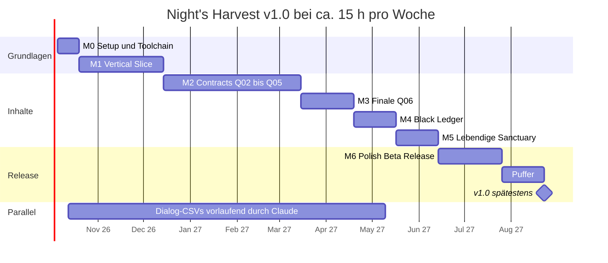

# Night's Harvest – Entwicklungs-Roadmap

2026-09-21 · @Someone

## Überblick & Zeitplan

v1.0 ist bei ca. 15 Stunden pro Woche bis Ende Juli 2027 machbar, mit Puffer bis spätestens 22. August 2027. Der Weg führt über sieben Meilensteine mit rund 630 Stunden Arbeit plus 60 Stunden Reserve.

### Planungsannahmen

- **Kapazität:** ca. 15 Stunden pro Woche, also etwa 30 Stunden je 2-Wochen-Sprint.
- **Start:** Montag, 5. Oktober 2026, nach Freigabe des Konzepts.
- **Erfahrung:** Grundkenntnisse im Creation Kit. Ohne sie kommen in M0 und M1 etwa 40–60 Stunden Einarbeitung dazu.
- **Team:** Solo-Entwicklung im CK. Claude liefert Scripts, Dialog-CSVs, Tools, Anleitungen und Reviews.
- **Umfang:** v1.0 wie im Konzept-Tab beschrieben. Bei Zeitdruck greifen die Scope-Hebel aus Konzept-Abschnitt 18.
- **Planungstiefe:** M0 und M1 sind bis auf Sprint-Ebene geplant, spätere Meilensteine auf Arbeitspaket-Ebene. Deren Sprints werden zu Beginn des jeweiligen Meilensteins geschnitten.

### Meilensteine

| Meilenstein | Version | Aufwand (h) | Zielende | Ergebnis |
| --- | --- | --- | --- | --- |
| M0 Setup & Toolchain | 0.0.1 | 30 | 2026-10-18 | Leeres Plugin mit Script installiert sich per FOMOD in Vortex |
| M1 Vertical Slice | 0.1.0 | 120 | 2026-12-13 | Q00 und Q01 vollständig spielbar |
| M2 Contracts | 0.2.0 | 195 | 2027-03-14 | Q02 bis Q05 spielbar, Follower-System komplett |
| M3 Finale | 0.3.0 | 75 | 2027-04-18 | Q06 in allen Varianten abschließbar |
| M4 Black Ledger | 0.4.0 | 60 | 2027-05-16 | Freies Rekrutieren mit 12 Slots |
| M5 Lebendige Sanctuary | 0.5.0 | 60 | 2027-06-13 | Alle Räume, Banter, Tagesabläufe |
| M6 Polish, Beta & Release | 0.9.x → 1.0.0 | 90 | 2027-07-25 | Veröffentlichung auf Nexus Mods |
| Puffer | 1.0.0 spätestens | 60 | 2027-08-22 | Reserve für Feiertage, CK-Probleme und Beta-Funde |



Der Dialog-Track läuft parallel: Claude schreibt die CSVs jeweils einen Meilenstein im Voraus, damit die CK-Arbeit nie auf Texte wartet.

## Arbeitsweise

Gearbeitet wird in 2-Wochen-Sprints mit je einem spielbaren Ziel. Das ESP bearbeitet immer nur eine Person, und jede CK-Session endet mit einem Commit.

### Sprint-Rhythmus

- **Sprint:** 2 Wochen, ca. 30 Stunden. Das Ziel ist ein spielbarer Zustand, z. B. „Q00 Szene 1–3 spielbar ab Save T02“.
- **Planung (30 min):** Arbeitspakete aus dem Backlog ziehen, benötigte Claude-Lieferungen anstoßen.
- **Review (30 min):** Test-Save durchspielen, Papyrus-Log prüfen, Board und Status in diesem Tab aktualisieren.
- **Alle zwei Sprints:** Ist-Stunden gegen Plan abgleichen (Abschnitt Tracking).

### Board (GitHub Projects)

| Element | Festlegung |
| --- | --- |
| Spalten | Backlog → Bereit → In Arbeit → Test → Fertig |
| Labels | `quest:Q00` bis `quest:Q06`, `sys:core`, `sys:family`, `sys:ledger`; `typ:script`, `typ:dialog`, `typ:zelle`, `typ:npc`, `typ:szene`, `typ:tool`, `typ:bug`; `prio:hoch`, `prio:mittel`, `prio:niedrig` |
| Definition of Ready | Spezifikation im Konzept vorhanden, EditorIDs vergeben, Dialog-CSV liegt vor |
| Definition of Done | Wie Konzept-Abschnitt 17 |

### Git-Workflow

| Thema | Regel |
| --- | --- |
| Branches | `main` ist immer spielbar. Kurze Feature-Branches nur für Scripts und Tools (`feat/q00-core`). ESP-Änderungen direkt auf `main`, weil Binärdateien nicht zusammengeführt werden können. |
| Commits | ESP, Spriggit-Export und Scripts immer gemeinsam. Nachricht im Format `[Q00] Szene 1: Marker und Packages`. |
| Tags | `v0.1.0` je Meilenstein, `v0.9.x` für Betas, `v1.0.0` zum Release. |
| Nicht versionieren | Build-Artefakte (`.pex`, `.bsa`, `.7z`). Pyro erzeugt sie reproduzierbar; Release-Archive liegen in GitHub Releases. |

### CK-Session-Routine

1. **Vorher:** `git pull`, ESP-Backup mit Zeitstempel, in Vortex deployen.
2. **Start:** CK nur mit CKPE, `NightsHarvest.esp` als aktive Datei.
3. **Während:** alle 15–20 Minuten speichern, nach Navmesh- oder Szenenarbeit sofort.
4. **Nachher:** Spriggit-Export, Scripts per Pyro kompilieren, kurzer Ingame-Check per `coc`, Commit.
5. **Wöchentlich:** xEdit „Check for Errors“ und Vanilla-Override-Filter.

### Zusammenarbeit mit Claude

- Pro Arbeitspaket ein Chat in diesem Projekt, gestartet mit der Briefing-Vorlage aus dem letzten Abschnitt.
- Claude liefert Scripts, Dialog-CSVs, Record-Listen, CK-Schrittanleitungen, Python-Tools und FOMOD-XML.
- Rückmeldung an Claude: Auszüge aus dem Papyrus-Log, CK-Screenshots, beobachtetes Ingame-Verhalten.
- Der Konzept-Tab bleibt die Quelle der Wahrheit. Designänderungen landen dort als Edit oder Kommentar, bevor sie umgesetzt werden.

## M0 – Setup & Toolchain

M0 ist fertig, wenn ein leeres `NightsHarvest.esp` mit Script per FOMOD in Vortex installiert wird und im Spiel seine Versionsmeldung zeigt. Ziel: 18. Oktober 2026, ca. 30 Stunden inklusive Einarbeitung.

| ID | Arbeitspaket | Aufgaben | Wer | h | Status |
| --- | --- | --- | --- | --- | --- |
| M0.1 | Spielumgebung sichern | Steam-Updates auf „nur beim Spielstart“, Spiel über den SKSE-Loader starten, Backup des Spielordners, Clean-Profil in Vortex (SKSE, SkyUI, USSEP) | Du | 3 | Offen |
| M0.2 | Creation Kit | CK über Steam installieren, CKPE einrichten, `Scripts.zip` nach `Data/Source/Scripts` entpacken, `CreationKitCustom.ini` anlegen | Du, Claude (Anleitung) | 4 | Offen |
| M0.3 | Papyrus-Toolchain | VS Code mit Papyrus-Extension, Pyro, `NightsHarvest.ppj` mit Imports für Vanilla-, SKSE- und SkyUI-SDK-Quellen | Claude (ppj), Du (Setup) | 4 | Offen |
| M0.4 | Repository & Board | Privates GitHub-Repo mit Struktur aus Konzept-Abschnitt 14, `.gitignore`, README, Board mit Labels | Claude (Vorlagen), Du | 3 | Offen |
| M0.5 | Spriggit, xEdit, LOOT | Spriggit installieren und Round-Trip testen (ESP → Text → ESP), xEdit und LOOT einrichten | Du | 3 | Offen |
| M0.6 | Smoke-Test | Quest `NHV_Sys_Core` (Start Game Enabled) mit `NHV_CoreScript` und Versionsmeldung, Pyro-Build inkl. BSA, Minimal-FOMOD, Installation in Vortex, Ingame-Test | Claude (Script, FOMOD), Du (CK, Test) | 6 | Offen |
| M0.7 | Record-Inventar M1 | Tabelle aller EditorIDs für M1 mit Typ, Zweck und Quest | Claude | 2 | Offen |
| M0.8 | Entscheidungen | E05 treffen; E01, E02, E06, E12, E14 und E16 bis Start M1 vorbereiten | Du | 1 | Offen |

Reihenfolge: M0.1 → M0.2 → M0.3 → M0.6. M0.4, M0.5 und M0.7 laufen parallel. Bei wenig CK-Erfahrung zusätzlich zwei bis drei Abende mit den Quest- und Dialog-Grundlagen aus dem Creation Kit Wiki einplanen.

### Exit-Kriterien

- [ ] Das Smoke-Test-Paket installiert sich in Vortex ohne Warnung und zeigt ingame „Night's Harvest 0.0.1 loaded“.
- [ ] Pyro erzeugt Scripts, BSA und Release-Archiv mit einem Befehl.
- [ ] Spriggit-Round-Trip ohne Unterschiede.
- [ ] Repository und Board stehen, erster Commit ist getaggt (`v0.0.1`).
- [ ] E05 ist entschieden.

## M1 – Vertical Slice

M1 macht Q00 und Q01 vollständig spielbar und beweist die ganze Pipeline vom CK bis zum Vortex-Paket. Ziel: 13. Dezember 2026, ca. 120 Stunden, interne Version 0.1.0.

| ID | Arbeitspaket | Aufgaben | Wer | h | Status |
| --- | --- | --- | --- | --- | --- |
| M1.1 | Core-System | `NHV_CoreScript` (Version, `Maintenance()`, SKSE-Check, Startbedingung „Hail Sithis!“, Wartezeit), `NHV_PlayerAliasScript`, `NHV_Cfg_*`-Globals, MCM-Seiten Status und General | Claude (Scripts), Du (CK) | 14 | Offen |
| M1.2 | Veyra | NPC-Record, Gesicht mit FaceGen-Export (Strg+F4, sonst dunkles Gesicht ingame), Outfit, Trainer, `NHV_VoiceVeyra`, nachtaktive Alias-Packages | Du, Claude (Werte, Packages) | 12 | Offen |
| M1.3 | Deep Sanctuary Stufe 1 | Zelle mit Hall of Whispers, Ledger Room, Memorial Wall und Initiates' Dormitory, versiegelte Passage für Q00 Szene 4, gesperrte Übergänge zu den übrigen Räumen, Navmesh, Room Bounds, Beleuchtung, Zugang (Hinweis unten) | Du, Claude (Raumliste, Anleitung) | 22 | Offen |
| M1.4 | Sanctuary-Aliase | `NHV_Sys_Sanctuary` mit optionalen Aliasen für Nazir, Babette, Cicero, Night Mother; Testfall „Cicero tot“ | Claude, Du | 6 | Offen |
| M1.5 | Q00 A Shadow at the Door | Stages 10–100, Szenen 1–6, Draugr-Passage, Memorial Wall, Journal, Dialoge aus CSV | Claude (CSV, Fragmente), Du (CK) | 30 | Offen |
| M1.6 | Family-Grundgerüst | `NHV_Sys_Family` mit Story-Rekruten-Aliasen, Status-Globals, `NHV_RecruitAliasScript`, ein einfacher Follower-Slot | Claude, Du | 10 | Offen |
| M1.7 | Q01 + Contract-Basis | `NHV_ContractBaseScript` mit Q01 als erster Anwendung; Hrefna, Agent Quintus, Schauplätze in Morthal, Fragment 1, Bogwife's Knife, Grundausbau der Kitchen | Claude, Du | 20 | Offen |
| M1.8 | Dialog-Pipeline | Lint-Tool v1, CSV-Eingabe ins CK festlegen, Test mit Fuz Ro D-oh | Claude (Tool), Du (Test) | 4 | Offen |
| M1.9 | Test & 0.1.0 | Definition of Done für Q00 und Q01, Saves T02 und T03, Break-Tests BT01–BT05, Record-Inventur für E04, interner Build | Du, Claude (Protokolle) | 8 | Offen |

### Sprint-Plan

| Sprint | Zeitraum | Arbeitspakete | Spielbares Ziel |
| --- | --- | --- | --- |
| S1 | 19.10.–01.11.2026 | M1.1, M1.2, M1.4 | Veyra steht in einer Testzelle, MCM zeigt Status, Q00 startet nach „Hail Sithis!“ |
| S2 | 02.11.–15.11.2026 | M1.3, M1.8, Beginn M1.5 | Deep Sanctuary betretbar, erste Q00-Zeilen im Spiel |
| S3 | 16.11.–29.11.2026 | M1.5, Beginn M1.6 | Q00 von Szene 1 bis 6 durchspielbar |
| S4 | 30.11.–13.12.2026 | Rest M1.6, M1.7, M1.9 | Q01 abgeschlossen, Hrefna lebt im Sanctuary, 0.1.0 getaggt |

S4 ist mit ca. 34 Stunden der engste Sprint. Rutscht er, wandert der Testteil M1.9 in die erste Woche von M2.

### Hinweis zum Zugang (Entscheidung E16)

Jede Referenz, die in einer Vanilla-Zelle platziert wird, auch die Load Door zum Deep Sanctuary, zieht eine Kopie des Vanilla-Zell-Records ins Plugin. Die Kopie ändert inhaltlich nichts, kann aber Änderungen anderer Mods an derselben Zelle (z. B. Beleuchtung) überdecken, wenn Night's Harvest später lädt. Konzept-Abschnitt 15 („null Overrides“) ist hier zu streng formuliert und sollte um diese Ausnahme ergänzt werden.

| Option | Vorteil | Nachteil |
| --- | --- | --- |
| A: Load Door mit Zell-Kopie | Normales Türverhalten, Ladebildschirm, Kartenmarker | Zell-Konflikte mit Sanctuary- und Beleuchtungs-Mods möglich |
| B: Script-Tür (Activator mit Tür-Mesh, zur Laufzeit per `PlaceAtMe` relativ zu einer Vanilla-Referenz platziert, versetzt per `MoveTo`) | Keine Zell-Kopie in der Sanctuary | Kein echtes Türverhalten, Follower brauchen Script-Hilfe |

Dieselbe Frage stellt sich bei Quest-Referenzen in Städten (Q01–Q05). Grundregel dafür: Schlüsselszenen in eigenen Innenzellen, berührte Vanilla-Zellen minimieren und in einer Liste führen.

### Exit-Kriterien

- [ ] Q00 und Q01 von Save T02 und T03 aus vollständig spielbar, Definition of Done erfüllt.
- [ ] Installation von 0.1.0 per FOMOD in Vortex, Start in einem bestehenden Spielstand ohne Log-Fehler.
- [ ] Record-Inventur liegt vor, E04 (ESP oder ESL) ist entschieden.
- [ ] E01, E02, E06, E12, E14 und E16 sind entschieden.

## M2 – Contracts Q02 bis Q05

M2 macht die vier weiteren Rekrutierungs-Contracts spielbar und schließt das Follower-System ab. Ziel: 14. März 2027, ca. 195 Stunden Kapazität bei ca. 210 geplanten Stunden, Version 0.2.0.

Gebaut wird in Story-Reihenfolge, weil Dispatch-Fragmente, Banter-Voraussetzungen und Veyras Dialoge aufeinander aufbauen. Jeder Contract nutzt `NHV_ContractBaseScript` aus M1 und bringt den Grundausbau des Raums seines Rekruten mit, damit dessen Service sofort funktioniert.

| ID | Arbeitspaket | Aufgaben | Wer | h | Status |
| --- | --- | --- | --- | --- | --- |
| M2.1 | Follower-System komplett | Zwei Slots, Befehle „Walk with me“, „Wait here“, „Go home“, Inventar, Catch-up-Teleport, Grundlage für den Kompatibilitätsmodus, Rekruten-Zeilen für Hrefna | Claude (Scripts, CSV), Du (CK) | 20 | Offen |
| M2.2 | Q02 Cold Waters | Windhelm-Schauplätze, Sings-Beneath-Ice, Clerk Aelius, Fragment 2, Shadowscale Wraps, Grundausbau Drowned Pool | Claude, Du | 35 | Offen |
| M2.3 | Q03 The Scholar's Sin | Winterhold, Nirelda, neuer Dungeon Hollowfrost Spire (Zelle, Navmesh, Encounter Zone), Rätsel „The Four Stillnesses“, Fragment 3, Circlet of the Last Breath, Grundausbau Arcanum | Claude, Du | 55 | Offen |
| M2.4 | Q04 Till Death Do Us Part | Riften, Corisande, Dinner-Szene im Bee and Barb, Aurelian Cato, Fragment 4, Widow's Ring, Fence-Funktion, Grundausbau Velvet Counter | Claude, Du | 40 | Offen |
| M2.5 | Q05 Blood of the Stronghold | The Reach, Kharzog, Arena „The Red Pit“, Buchmacher Varus, Fragment 5, Oathbreaker, Grundausbau Forge | Claude, Du | 40 | Offen |
| M2.6 | Rekruten-Grundzeilen & Services | Greeting-, Idle- und Kampf-Zeilen aller vier neuen Rekruten, Trainer- und Händler-Setup | Claude (CSV), Du (CK) | 10 | Offen |
| M2.7 | Integrationstest & 0.2.0 | Durchlauf Q00–Q05 am Stück, alle Entscheidungstabellen, Update-Test 0.1.0 → 0.2.0, Save-Gesundheit | Du, Claude (Protokolle) | 12 | Offen |

Q03 ist das größte Einzelpaket, weil der Dungeon komplett neu gebaut wird. Für die Dinner-Szene in Q04 gilt die Zell-Regel aus M1: Die Szene nutzt die Vanilla-Zelle des Bee and Barb nur, wenn E16 das zulässt; sonst spielt sie in einem neuen Hinterzimmer.

### Sprints

Fünf bis sechs Sprints, geschnitten zu Beginn von M2. Die Weihnachtszeit fällt in diesen Meilenstein und ist im Gesamtpuffer berücksichtigt.

### Exit-Kriterien

- [ ] Q02 bis Q05 mit allen Pfaden ihrer Entscheidungstabellen abschließbar.
- [ ] Fünf Story-Rekruten leben im Sanctuary, ihre Services funktionieren.
- [ ] Zwei Familien-Follower gleichzeitig, ohne den Vanilla-Follower-Slot zu belegen.
- [ ] Update von 0.1.0 auf 0.2.0 im laufenden Spielstand ohne Fehler.
- [ ] E03 (Release-Strategie) ist entschieden.

## M3 – Finale Q06 Blood Harvest

M3 macht das Finale in beiden Ansätzen und mit allen Ausgängen abschließbar. Ziel: 18. April 2027, ca. 75 Stunden, Version 0.3.0.

| ID | Arbeitspaket | Aufgaben | Wer | h | Status |
| --- | --- | --- | --- | --- | --- |
| M3.1 | Livia & Oculatus | Livia Maro als NPC, `NHV_OculatusFaction`, Leveled Lists der Agenten in vier Stufen, Ausrüstung | Claude (Werte), Du (CK) | 10 | Offen |
| M3.2 | Ansatz A „Strike First“ | Frostmere Watch als neue Innenzelle mit Außenzugang, Wahl von zwei Begleitern mit eigenen Wegen, Bosskampf | Claude, Du | 22 | Offen |
| M3.3 | Ansatz B „Hold the Door“ | Fünf Vorbereitungen (drei wählbar), `NHV_FinaleWaveScript`, drei Wellen per `PlaceAtMe` an der Black Door, Pause beim Verlassen | Claude (Script), Du (CK) | 18 | Offen |
| M3.4 | Livia-Pfad | Bedingungen (Speech 75 oder mindestens vier Rekruten), Dialog, Übernahme als Rekrutin | Claude, Du | 8 | Offen |
| M3.5 | Zeremonie & Belohnungen | Abschluss-Szene, Black Ledger als Item, Vergabe der Lesser Power „Sense the Darkness“ (Effekt folgt in M4), 2.000 Gold, MCM-Seite Finale & Difficulty | Claude, Du | 9 | Offen |
| M3.6 | Test & 0.3.0 | Alle Varianten inkl. „Family can die“ an und aus, BT08 und BT14 | Du, Claude (Protokolle) | 8 | Offen |

Der Außenzugang von Frostmere Watch berührt eine Außenzelle der Welt Tamriel und ist damit der konfliktträchtigste Punkt des Mods. Die Stelle wird vor dem Bau im Heavy-Profil geprüft: abseits von Straßen, Städten und bekannten Landschafts-Mods. M3.4 ist der erste Scope-Hebel, falls der Meilenstein über Plan läuft (E08).

### Exit-Kriterien

- [ ] Beide Ansätze mit allen Ausgängen abschließbar, auch mit null überlebenden Rekruten.
- [ ] Wellen überstehen Speichern, Laden und das Verlassen des Sanctuary.
- [ ] Frostmere-Zugang im Heavy-Profil ohne sichtbare Überschneidungen.
- [ ] E08 ist entschieden.

## M4 – Black Ledger

M4 schaltet das freie Rekrutieren nach dem Finale frei: bis zu 12 Rekruten, Eignungsprüfung, Initiation und Verwaltung. Ziel: 16. Mai 2027, ca. 60 Stunden, Version 0.4.0.

| ID | Arbeitspaket | Aufgaben | Wer | h | Status |
| --- | --- | --- | --- | --- | --- |
| M4.1 | Ledger-Quest | `NHV_Sys_Ledger` mit 12 Slot-Aliasen, `NHV_RecruitAliasScript` für generische Rekruten, Fraktionen `NHV_CandidateFaction` und `NHV_InitiateFaction` | Claude (Scripts), Du (CK) | 10 | Offen |
| M4.2 | Eignungsprüfung | `CanRecruit()`, FormList `NHV_RecruitBlacklist`, Fraktions-Blacklist, Morality-Schwelle, Unique-Option | Claude, Du | 8 | Offen |
| M4.3 | Sense the Darkness | Spell mit Cloak-Magic-Effect, Conditions am Effekt, Markierungs-Shader, Radius aus dem MCM | Claude, Du | 8 | Offen |
| M4.4 | Generischer Rekrutierungsdialog | 12 Zeilen mit Conditions und Speech-Checks, Abdeckung aller Vanilla-VoiceTypes (Liste per xEdit erzeugen) | Claude (CSV, Liste), Du (CK) | 12 | Offen |
| M4.5 | Initiation & Verwaltung | Drei-Tage-Timer über Spielzeit-Global, `MoveTo` ins Dormitory, Verwaltung über Veyra, Entlassen, MCM-Seite Black Ledger mit Mitgliederliste | Claude, Du | 14 | Offen |
| M4.6 | Test & 0.4.0 | BT11, BT12, Stresstest mit 12 Rekruten in Städten, Save-Gesundheit | Du, Claude (Protokolle) | 8 | Offen |

Generische Rekruten sprechen die neuen Zeilen zunächst stumm mit Untertiteln. Das Voice-Pack in v1.1 deckt nur die eigenen VoiceTypes ab; für Vanilla-VoiceTypes bleibt Fuz Ro D-oh die Empfehlung.

### Exit-Kriterien

- [ ] 12 Slots belegbar, der 13. Versuch meldet sich sauber ab.
- [ ] Essential- und Blacklist-NPCs sind nie wählbar.
- [ ] Entlassene Rekruten kehren an ihren Ursprungsort zurück und verlieren alle NHV-Fraktionen.
- [ ] Kein spürbarer Script-Lag bei aktivem „Sense the Darkness“ in Solitude oder Whiterun.
- [ ] E13 ist entschieden.

## M5 – Lebendige Sanctuary

M5 füllt das Sanctuary mit Leben: alle elf Räume fertig, Banter, neue Zeilen der Vanilla-Figuren und vollständige Tagesabläufe. Ziel: 13. Juni 2027, ca. 60 Stunden, Version 0.5.0.

| ID | Arbeitspaket | Aufgaben | Wer | h | Status |
| --- | --- | --- | --- | --- | --- |
| M5.1 | Räume fertigstellen | Shrine of the Void und Training Hall neu; alle Räume mit Enable-Parent-Stufen (verfallen, eingerichtet), Dekoration, finale Room Bounds | Du, Claude (Objektlisten) | 20 | Offen |
| M5.2 | Banter-System | `NHV_BanterControllerScript`, Szenen B01–B12, Frequenz aus dem MCM | Claude (Script, CSV), Du (CK) | 14 | Offen |
| M5.3 | Vanilla-Figuren | Neue Zeilen für Nazir, Babette, Cicero, Night Mother und Delvin, Szene „The Keeper and the Gleaner“ | Claude (CSV), Du (CK) | 12 | Offen |
| M5.4 | Tagesabläufe | Packages für alle Mitglieder, Idle-Marker, Furniture, Schlafplätze | Claude (Package-Plan), Du (CK) | 8 | Offen |
| M5.5 | Spielerzustände | Kommentare zu Vampir, Werwolf, Arch-Mage, Gildenleitungen | Claude (CSV), Du (CK) | 4 | Offen |
| M5.6 | Performance & 0.5.0 | Framerate im Sanctuary, Papyrus-Log, Save-Gesundheit nach 20 Stunden Testspiel | Du | 4 | Offen |

Die Grundausbauten aus M1 und M2 bleiben erhalten. M5 ergänzt nur Dekoration und Renovierungsstufen, damit bestehende Spielstände nichts verlieren.

### Exit-Kriterien

- [ ] Alle elf Räume begehbar und in beiden Zuständen korrekt.
- [ ] Banter spielt in der eingestellten Frequenz, nie zwei Szenen gleichzeitig.
- [ ] Keine Package-Konflikte: Mitglieder schlafen, essen und arbeiten an ihren Plätzen.
- [ ] Framerate im Sanctuary im Rahmen vergleichbarer Vanilla-Innenräume.

## M6 – Polish, Beta & Release

M6 bringt 1.0.0 auf Nexus Mods: Ende Juli 2027 geplant, spätestens 22. August 2027 mit Puffer, ca. 90 Stunden.

| ID | Arbeitspaket | Aufgaben | Wer | h | Status |
| --- | --- | --- | --- | --- | --- |
| M6.1 | MCM komplett | Seiten Family, Finale & Difficulty, Compatibility, Maintenance & Debug; Hilfetexte; „Prepare for Uninstall“ | Claude (Script), Du (Test) | 14 | Offen |
| M6.2 | Kompatibilität | Tests im Heavy-Profil, Patches für Sanctuary- und Stadt-Mods, Follower-Kompatibilitätsmodus | Du, Claude (Patch-Anleitungen) | 18 | Offen |
| M6.3 | Beta | 0.9.0 an 5–15 Tester, zwei Runden à zwei Wochen, Bug-Triage und Fixes | Du, Claude (Triage, Fixes) | 20 | Offen |
| M6.4 | Legacy-Test | Kompletter Durchlauf auf SE 1.5.97 | Du | 6 | Offen |
| M6.5 | Release-Paket | FOMOD final mit Patch-Erkennung, Nexus-Seite (Text, Screenshots, Anforderungen, Berechtigungen), README, Changelog | Claude (Texte, XML), Du (Bilder, Upload) | 14 | Offen |
| M6.6 | Release | Namensprüfung (E15), Upload 1.0.0, LOOT-Metadaten einreichen, Support in der ersten Woche | Du | 10 | Offen |

Ab Beginn der Beta gilt Feature-Freeze: Nur noch Fixes, keine neuen Inhalte.

### Release-Checkliste

- [ ] Keine Vanilla-Overrides außer den dokumentierten Zell-Kopien.
- [ ] 0 ITM, 0 UDR, xEdit „Check for Errors“ ohne Befund.
- [ ] Alle Quests erfüllen die Definition of Done auf AE und SE 1.5.97.
- [ ] Keine offenen Bugs der Stufen „kritisch“ oder „hoch“.
- [ ] FOMOD frisch in Vortex und MO2 getestet, Patch-Erkennung korrekt.
- [ ] Nexus-Seite nennt SKSE64 und SkyUI als Anforderungen.
- [ ] Update-Test von 0.9.x auf 1.0.0 bestanden.

### Nach v1.0

| Version | Inhalt | Aufwand grob (h) |
| --- | --- | --- |
| 1.0.x | Bugfixes nach Community-Meldungen | laufend |
| 1.1 Voices | Vertonung der ca. 2.200 Zeilen, Voice-Pack als eigener Download | 40–120, je nach Verfahren |
| 1.2 Phase 2 | Persönliche Rekruten-Quests, Dispatch-System, 20 Wanderers, optionaler Maulwurf | 150–250 |
| begleitend | Mantella-Bios, Unterstützung für Community-Übersetzungen | 5–10 |

## Tracking & Entscheidungs-Gates

Fortschritt wird pro Arbeitspaket im Status-Feld und pro Meilenstein mit Ist-Stunden gegen den Plan aus dem Überblick gemessen. Mehr als 25 % Abweichung löst eine Re-Planung aus.

### Meilenstein-Tracking

| Meilenstein | Ist (h) | Status |
| --- | --- | --- |
| M0 Setup & Toolchain | 0 | Offen |
| M1 Vertical Slice | 0 | Offen |
| M2 Contracts | 0 | Offen |
| M3 Finale | 0 | Offen |
| M4 Black Ledger | 0 | Offen |
| M5 Lebendige Sanctuary | 0 | Offen |
| M6 Polish, Beta & Release | 0 | Offen |

### Entscheidungs-Gates

Details und Empfehlungen zu E01–E15 stehen in Konzept-Abschnitt 19, E16 im Abschnitt M1 dieses Tabs.

| Nr. | Frage | Fällig | Status |
| --- | --- | --- | --- |
| E01 | Follower-System | vor M1 | Offen |
| E02 | Standard-Sterblichkeit der Rekruten | vor M1 | Offen |
| E03 | Release-Strategie | bis Ende M2 | Offen |
| E04 | Plugin-Format ESP oder ESL | Ende M1 | Offen |
| E05 | Master-Dateien | in M0 | Offen |
| E06 | MCM-Technik | vor M1 | Offen |
| E07 | Einstellungs-Export | vor M6 | Offen |
| E08 | Livia-Rekrutierungspfad in v1.0 | während M3 | Offen |
| E09 | Pathing in der Vanilla-Sanctuary | Ende M1 | Offen |
| E10 | Vertonung zum Start | vor M6 | Offen |
| E11 | Voice-Pack-Format | vor v1.1 | Offen |
| E12 | Amerikanisches oder britisches Englisch | vor M1 | Offen |
| E13 | Unique-NPCs im Black Ledger | vor M4 | Offen |
| E14 | Standard-Wartezeit bis Q00 | vor M1 | Offen |
| E15 | Finaler Mod-Name | vor M6 | Offen |
| E16 | Zugang Deep Sanctuary: Load Door oder Script-Tür | vor M1.3 | Offen |

### Kennzahlen je Review

- Ist-Stunden gegen Plan, pro Meilenstein.
- Implementierte Dialogzeilen gegen ca. 2.200 (aus dem Lint-Tool).
- Record-Zahl laut xEdit gegen die ESL-Grenze von 4.096.
- Offene Bugs nach Schweregrad.
- Papyrus-Fehler im letzten Testlauf, Ziel 0.

### Re-Planung

1. Nach jedem Meilenstein Ist gegen Plan vergleichen und die Zieltermine der folgenden Meilensteine anpassen.
2. Mehr als 25 % über Plan: Scope-Hebel aus Konzept-Abschnitt 18 der Reihe nach prüfen.
3. Zwei Sprints ohne spielbaren Fortschritt: Blocker gemeinsam mit Claude analysieren und das Arbeitspaket teilen.
4. Termine verschieben statt Qualität senken: Die Definition of Done bleibt.

### Briefing-Vorlage für Arbeitspaket-Chats

```markdown
**Arbeitspaket:** M1.5 Q00 – Szene 1 Standoff
**Ziel:** Was soll am Ende spielbar sein?
**Stand:** Welche Records, EditorIDs und Scripts existieren schon?
**Konzeptbezug:** z. B. Konzept-Abschnitt 6, Szene 1
**Gewünschte Lieferung:** Script / Dialog-CSV / CK-Anleitung / Review
**Probleme:** Papyrus-Log-Auszug, Screenshots, beobachtetes Verhalten
**Fertig, wenn:** konkrete Kriterien aus der Definition of Done
```
